The Watson Data Platform lab is conducted using the IBM cloud. It utilizes the suite of fully managed cloud data services; Cloudant NoSQL DB, dashDB for Analytics and Object Storage to persist data and Data Connect to ingest data. These services are available and deployed from Bluemix, IBM’s cloud platform. This lab also leverages Watson Analytics, IBM’s smart data discovery and visualization service on the cloud. Finally, this lab will also utilize the IBM Data Science Experience, an interactive, collaborative, cloud-based environment where data scientists can use multiple tools to activate their insights. 

## Workflow

On the following pages are a series of steps you need to complete before you do any of the labs. Each step outlines an easy to follow set of instructions that walks you through preparing your IBM cloud environment so you can do any of the labs you choose. It is a serial process so it’s important that you follow each step in sequence and do not deviate from the workflow or skip any steps in the process.

Step | Description
------------ | -------------
1 | Download the lab files
2 | Create a Bluemix account
3 | Create the Watson Data Platform lab services
4 | Create the Watson Data Platform lab application
5 | Create a Watson Analytics account
6 | Create a GitHub account

## Step 1: Download the lab files

**Download** the Great Outdoor Customer Orders CSV file to your workstation. This file is used in the Data Engineering, Business Analysis and Data Science sections of the lab. When downloading this file, you will be brought to a browser tab that exposes the content of the file. Use the "File" > "Save Page As ..." menu item to save this file. Be sure to use the .csv file extention.

### [Click Here to Download the "Great Outdoor Customer Orders.csv" file](https://github.com/WatsonDataPlatform/E2ELab/blob/master/GettingStarted/Great%20Outdoor%20Customer%20Orders.csv)

**Download** the nodejsDashboard Zip file to your workstation. This file is used in the Application Development lab.

### [Click Here to Download the "nodejsDashboard.zip" file](https://github.com/WatsonDataPlatform/E2ELab/blob/master/GettingStarted/nodejsDashboard.zip)

**Download** the Lab-DSX-ML Zip file to your workstation. This file is used in the Data Science lab.

### [Click Here to Download the "Lab-DSX-ML.zip" file](https://github.com/WatsonDataPlatform/E2ELab/blob/master/GettingStarted/Lab-DSX-ML.zip)

## Step 2: Create a Bluemix account

You will need a Bluemix account. Follow the instructions in one of the sections below depending on whether or not you have a Bluemix account.

## If you have a Bluemix account...

### Log Into Bluemix 

### [Click Here to Login to Bluemix](https://console.ng.bluemix.net/)

> **Note** - The URL for Bluemix is https://console.ng.bluemix.net

1. **Select** the "Log In" button. When prompted, enter your Bluemix ID and password.

### Create a Bluemix space

  

1. **Select** the account information area in the top right corner of your Bluemix home page.
2. **Select** the "Create a Space" link next to “Manage Organizations” below the space drop down list box.

  

3. **Enter** “Watson Data Platform” (without quotes) for the space name.  
4. **Select** the “Create” button.  

> The space will be created and you will be brought into it. You should now see, in the top right corner, that you are in the “Watson Data Platform” space in your Bluemix organization. You will use this space to house the Watson Data Platform lab services and application.

**Proceed to Step 3: Create the Watson Data Platform lab services**

## If you don't have a Bluemix account...

### [Click Here to Register for a Bluemix Account](https://console.ng.bluemix.net/registration/)

**Enter** the required information *(required fields are marked with an asterick)* on the right side panel.

1. **Seletct** the "I'm not a bot" check box.

> **Note** - You may be asked to verify multiple images. Select the Skip or Next button as instructed until you get to a screen (as shown above) with a Verify button.

2. **Select** the images you are instructed to select. For instance, Select all squares with street signs. 
3. **Select** the "Verify" button.

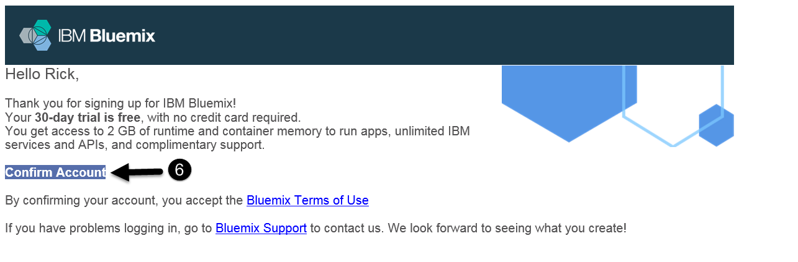

4. **Review** and check or uncheck the options to be kept informed of products, services and offerings from IBM.
5. **Select** the "Create Account" button when it is enabled for selection.

A page will appear notifying you to check your email to complete your registraion. Check the inbox of the email address that you supplied to register for your Bluemix account and open the email.

6. **Select** the “Confirm your account” link.

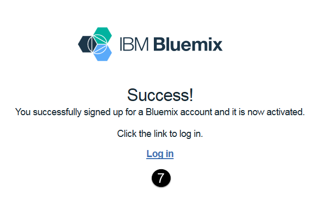

You will be brought to a web page confirming that you sucessfully signed up for Bluemix and that it is now activated.

7. **Click** on the "Log in" link to log into your Bluemix account.

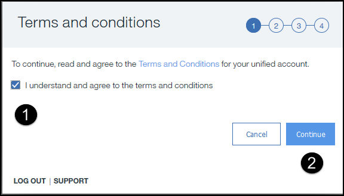

8. **Select** the checkbox to agree to the terms and conditions.
9. **Select** the “Continue” button.

> **Note** - I have redacted my email address on some screen shots to protect my identity, yours will be visible.

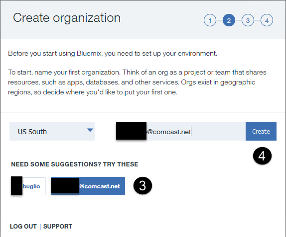

10. **Click** on the email address suggestion for an organization name. It will be automatically filled in for you as your organization name.
11. **Select** the “Create” button.

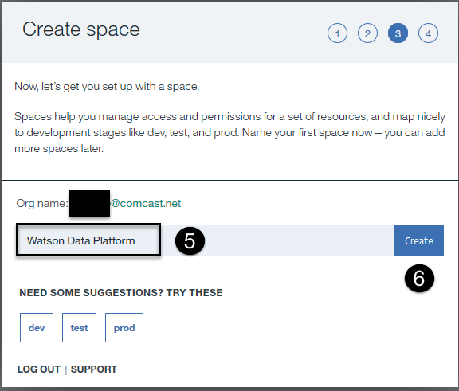

12. **Enter** “Watson Data Platform" (without quotes) as your Bluemix space name.
13. **Select** the "Create" button.

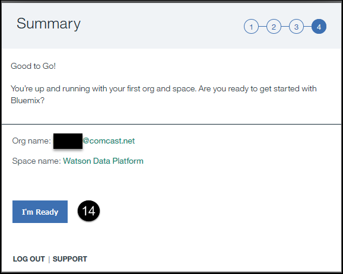

14. **Select** the "I'm Ready" button.

## Step 3: Create the Watson Data Platform lab services

1. **Select** the "Catalog" menu at the top of the Bluemix home page.

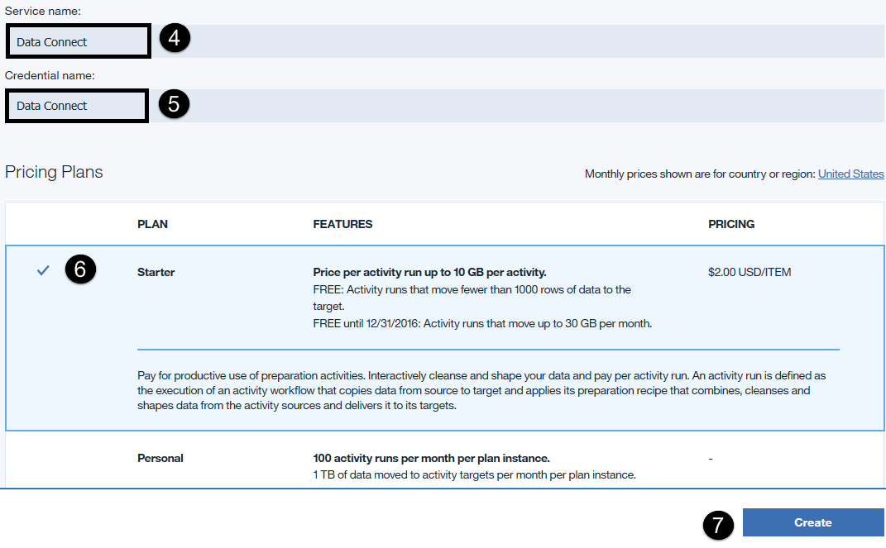

2. **Enter** "data connect" (without quotes) in the catalog search area.  
3. **Click on** the “Data Connect” service.  

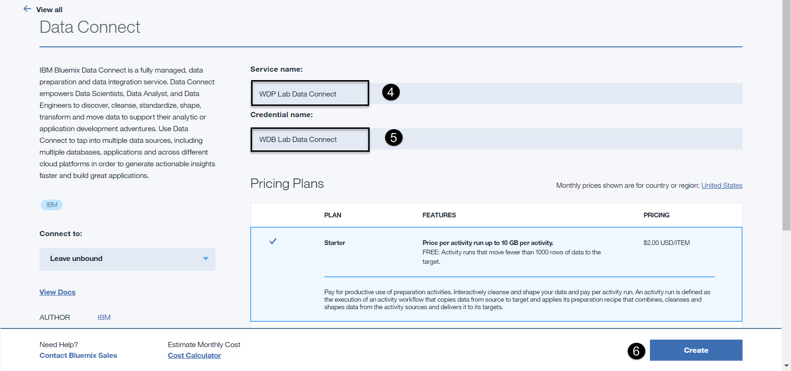

4. **Enter** "WDP Data Connect” (without quotes) for the Service name.  
5. **Enter** “WDP Data Connect” (without quotes) for the Credential name.  
6. **Select** the the "Create" button. The service will be created and the launch page is displayed.

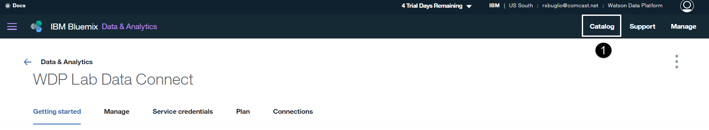

1. **Select** the "Catalog" menu at the top of the Bluemix home page.

2. **Enter** "cloudant" (without quotes) in the catalog search area.  
3. **Click on** the “Cloudant NoSQL DB” service.  

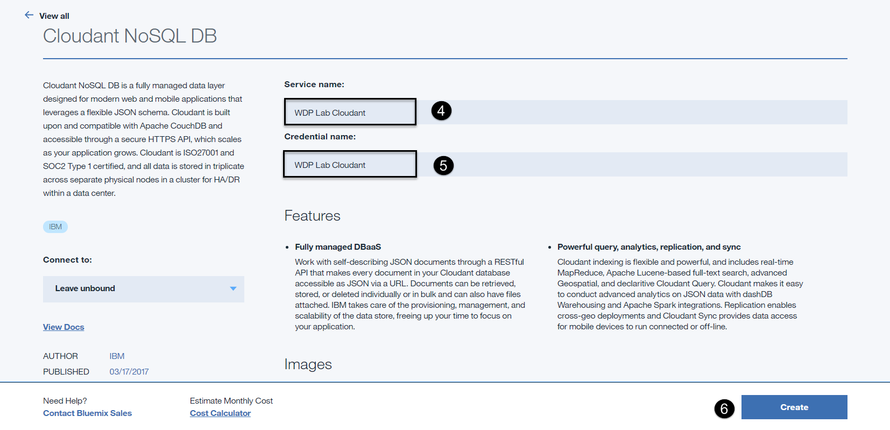

4. **Enter** "WDP Cloudant NoSQL DB” (without quotes) for the Service name.  
5. **Enter** “WDP Cloudant NoSQL DB” (without quotes) for the Credential name.  
6. **Select** the the "Create" button. The service will be created and the launch page is displayed.

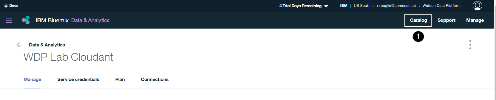

1. **Select** the "Catalog" menu at the top of the Bluemix home page.

2. **Enter** "dashdb" (without quotes) in the catalog search area.  
3. **Click on** the “dashDB for Analytics” service.  

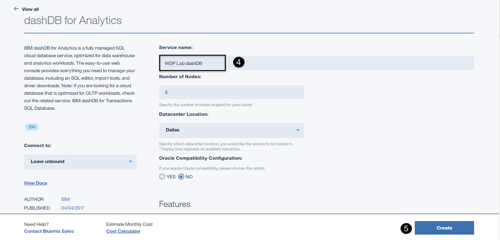

4. **Enter** "WDP dashDB for Analytics” (without quotes) for the Service name.   
5. **Select** the the "Create" button. The service will be created and the launch page is displayed.

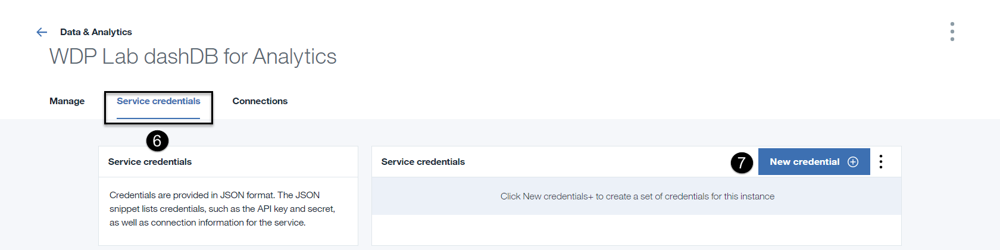

6. **Click On** the "WDP dashDB for Analytics" service you just created from the list of services.

7. **Select** the "Service credentials” section on the left from the WDP dashDB for Analytics launch page.   
8. **Select** the the "New credential +" button.

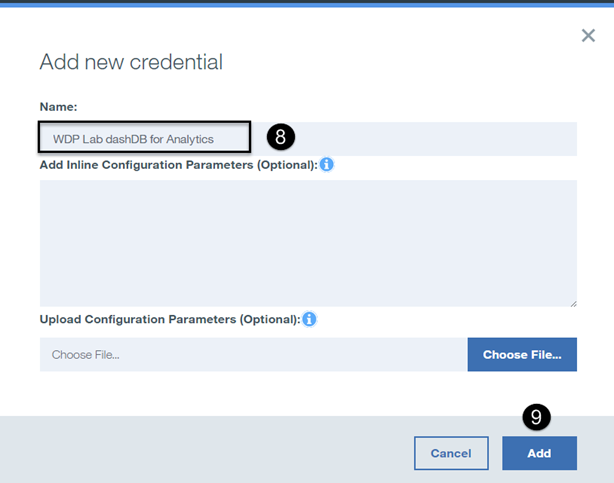

9. **Enter** "WDP dashDB for Analytics” (without quotes) for the credential name.   
10. **Select** the the "Add" button. The service credential will be created.

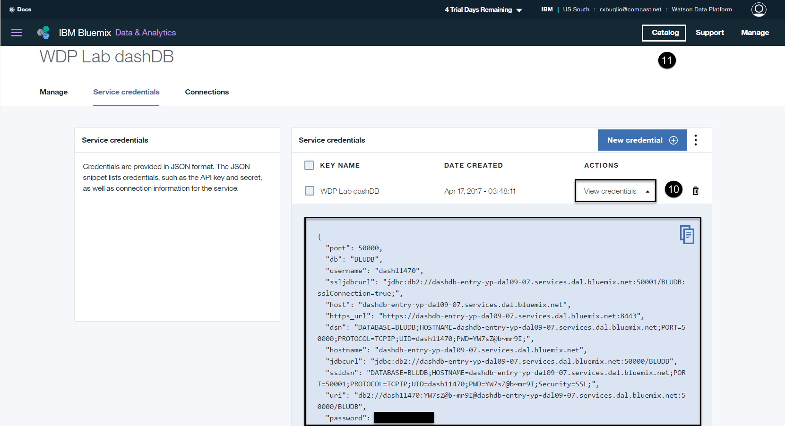

11. **Select** the "View credentials v" down arrow to view the newly created credentials.

> **Note** - These are the "WDP dashDB for Analytics" service credentials you will need to access the dashDB service in the Data Engineering and Data Science labs. Remember how to get back to this area of the service to access the credentials. I have redacted my password, to protect my identity, yours will be visible.

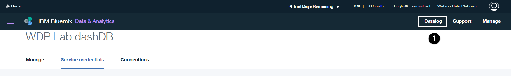

1. **Select** the "Catalog" menu at the top of the Bluemix home page.

2. **Enter** "apache spark" (without quotes) in the catalog search area.  
3. **Click on** the “Apache Spark” service.  

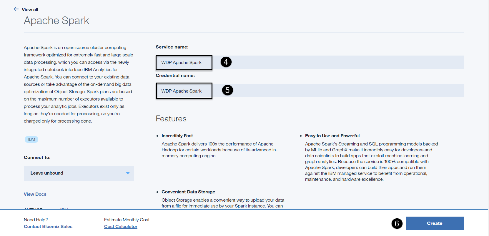

4. **Enter** "WDP Apache Spark” (without quotes) for the Service name.
5. **Enter** “WDP Apache Spark” (without quotes) for the Credential name. 
5. **Select** the "Create" button. The service will be created and the launch page is displayed.

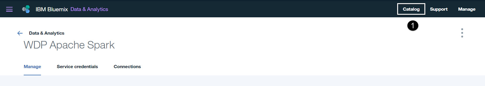

1. **Select** the "Catalog" menu at the top of the Bluemix home page.

2. **Enter** "cloud data store" (without quotes) in the catalog search area.  
3. **Click on** the “Object Storage” service.  

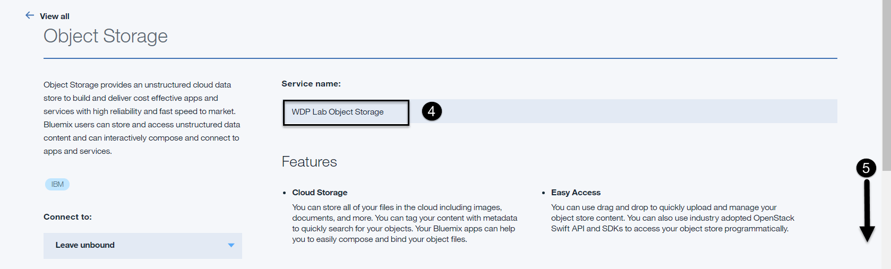

4. **Enter** "WDP Object Storage” (without quotes) for the Service name.
5. **Scroll down** the service page to the Pricing area.

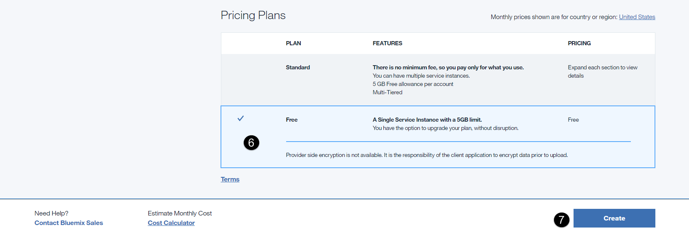

6. **Select** the "Free" service plan.
7. **Select** the "Create" button. You will receive a message that the service is being created and that it may take a few minutes. The message will disappear and you will be brought to the services dashboard of your Bluemix account.

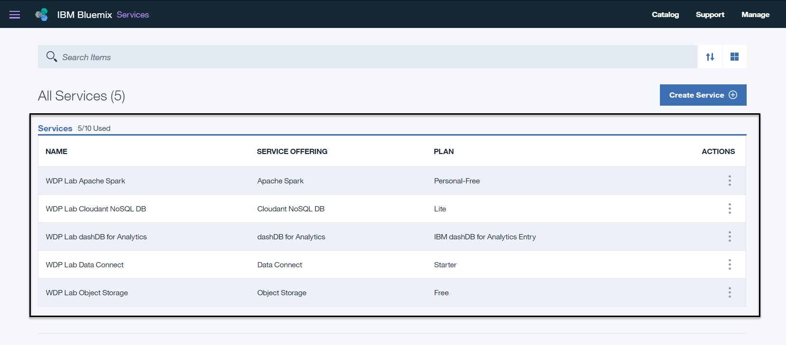

> **Note** - You should have 5 services in your services dashboard. These are the services that will be used across the Watson Data Platform labs; Data Engineering, Business Analytics, Data Science and Application Development.

## Step 4: Create the Watson Data Platform lab application

1. **Select** the "Catalog" menu at the top of the Bluemix home page.

2. **Enter** "cloud foundry" (without quotes) in the catalog search area.  
3. **Click on** the “SDK for Node.js" application.

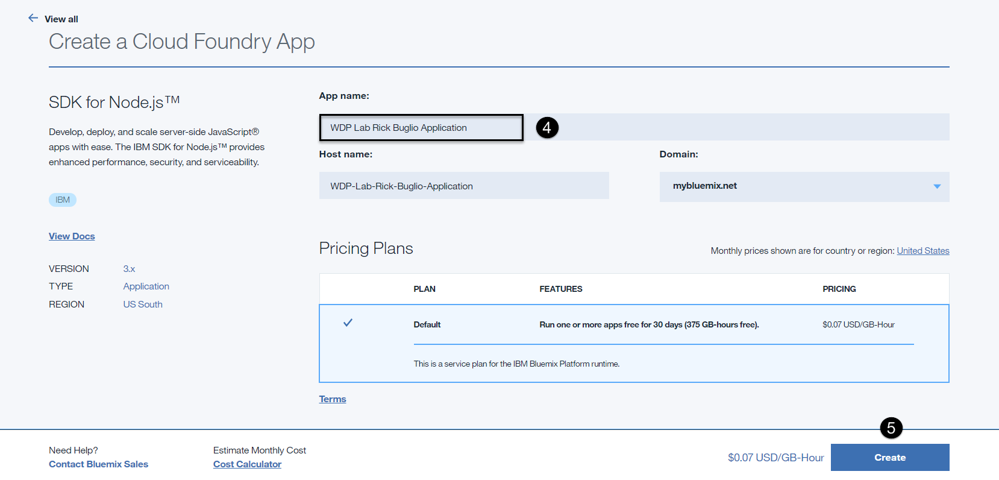

4. **Enter** "WDP Your Name” (without quotes), with "Your Name" equal to your First and Last Name. The Host name will be filled in automatically for you with dashes in place of spaces.

> Notice that my application name is "WDP Lab Rick Buglio Application" with a Host Name of "WDP-Lab-Rick-Buglio-Application". The Host Name of the application has to be unique in Bluemix. Using your first and last name should make it unique. If you get an error that the name is not unique add your middle initial, if you have one, or use your Bluemix account email address instead.

5. **Select** the "Create" button. The application creation process will begin. 

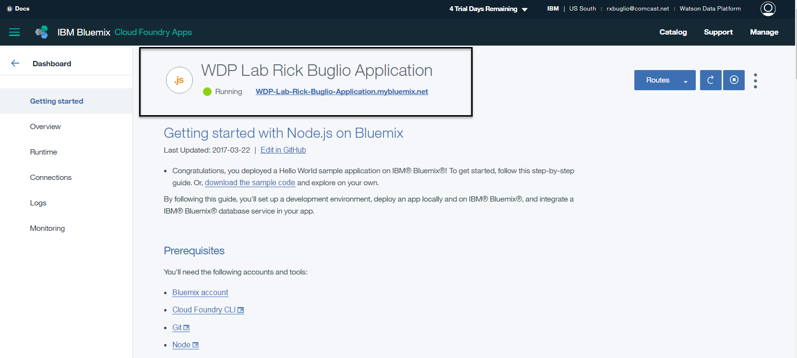

> You are brought to the application page and see that Bluemix has begun starting the application. You will see a starting status with a spinning wheel. Wait until you see that the application is a running status.

6. **Select** the "IBM Bluemix" folder in the top left corner of the menu after you see that the application is in a running state. This will take you back to your Bluemix account dashaboard.

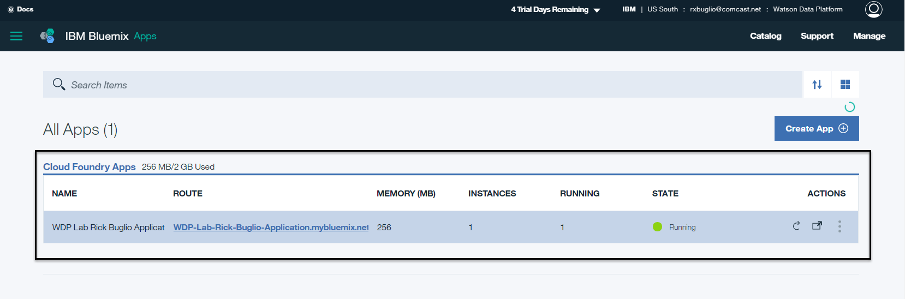

> You should see your application in the All Apps section of your Bluemix dashboard.

## Step 5: Create a Watson Analytics account

You will need a Watson Analytics account. If you **don't** have an account:

### [Click Here to Register for a Watson Analytics account](https://watson.analytics.ibmcloud.com/product)

1. **Select** the “Try it for free” button.

> Watson Analytics is IBM account aware. It is also Bluemix aware and knows if you are logged into Bluemix from within the same browser session. This can be very beneficial and is one of the reasons these instructions had you create a Bluemix account prior to creating a Watson Analytics account using the same browser session. Creating a Bluemix account creates an IBM account. Therefore, depending on whether or not you are logged into Bluemix in the same browser session you are requesting to create a Watson Analytics account, you will see one of the two scenarios below to register for a Watson Analytics account:

## If you are logged into Bluemix in the same browser session...

### You will see this registration page: 

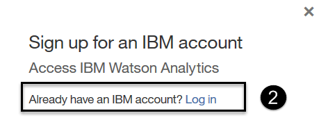
   
1. **Enter** the password for the IBM account displayed. My account is redacted to protect my identity.
2. **Select** the "Sign Up" button.

## If you are not logged into Bluemix in the same browser session...

### You will see this registration page:

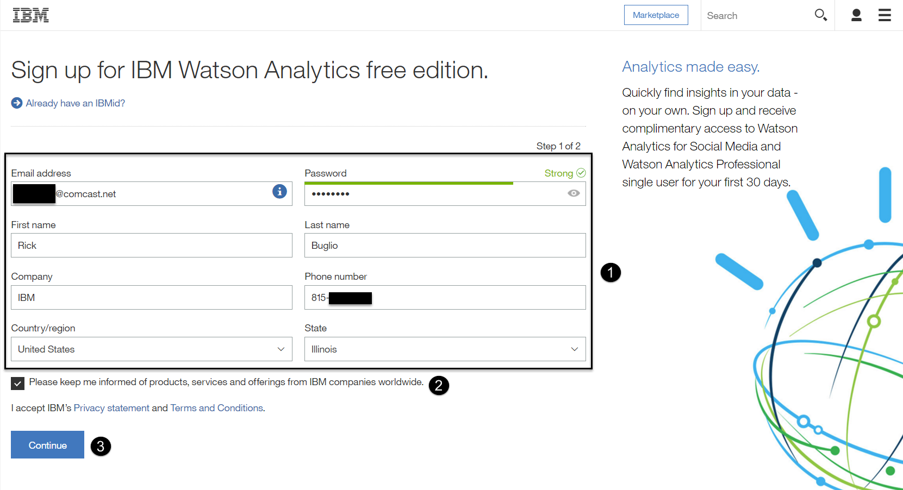

1. **Enter** an email address. 

> If the email address you enter does not exist as an IBM account, Watson Analytics will keep you on this page. If so, complete steps 2-4 below.

2. **Enter** all the required fields; Password, First and Last Name, Company, Phone Number, Country/region and State.
3. **Check** or **Uncheck** the box to keep informed of products and services and offerings from IBM worldwide.
4. **Select** the "Continue" button.

> If the email address already exists as an IBM account, Watson Analytics will switch to the page you see below with your email already designated. If so, complete steps 1-2 below.

1. **Enter** the password for the IBM account displayed. My IBMid is redacted to protect my identity.
2. **Select** the "Sign Up" button.

> You will be brought to the Sign Up page informing you “We have sent a confirmation code to verify your IBMId email address." You will be sent an email by ibmacct@us.ibm.com with a “Confirmation code” (7 digit number), to verify your email address.

To activate your account, **Go to** your email inbox that you used to register your Watson Analytics account to retrieve the confirmation code.

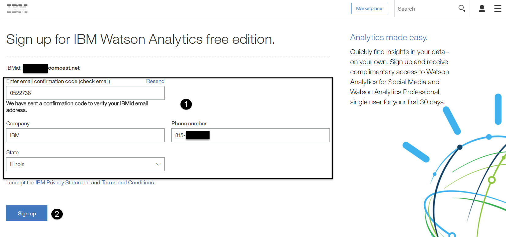

1. **Enter** the confirmation code you received in the email by typing it in or copy and pasting it from the email.
2. **Enter** your Company and Phone Number and select your State.
3. **Select** the "Sign Up" button.

> At this point, you will see a screen informing you that “Your new service subscription is being setup. You will receive an email when service provisioning has been completed”.

> In a few seconds you will be brought into a Welcome page that plays a video introducing you to Watson Analytics with a status of "Setting up your account" at the bottom of the page. 

1. When you are able, **Select** the "Continue to Watson Analytics" link.

2. **Select** the "Get Started ->" button.

3. **Click through** the exploration tour.

4. **Select** "Got it" when you get to the end of the exploration tour.

> Your Watson Analytics account is now ready for use. You have completed all of the Getting Started prerequisites and are ready to begin the Watson Data Platform labs. You can do the labs in any order you like but we strongly suggest you start by doing the Data Engineering lab first followd by Business Analysis, Data Science and then Application Development.

## Step 5: Create a GitHub account

You will need a GitHub account. If you **don't** have an account:

### [Click Here to Register for a GitHub account](https://github.com/)

1. **Enter** a Username.
2. **Enter** an Email. I recommend using the same Email Address you used for your Bluemix account.
3. **Enter** a Password. Again, I recommend using the same password you used for your Bluemix account.
4. **Select** the "Sign up for GitHub" button.

5. **Choose** the "Unlimited repositories for free" plan (It should be selected by default).
6. **Select** the "Continue" button.

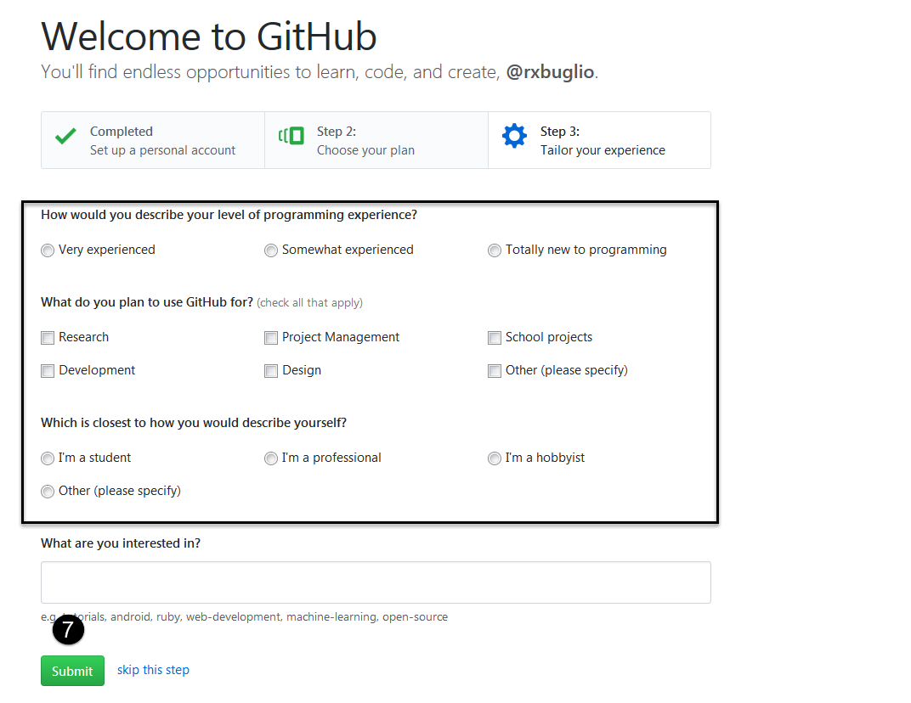

7. **Review** the "Tailor your experience" choices. Optionally select those you wish to supply or none of them.
8. **Select** the "Submit" button.

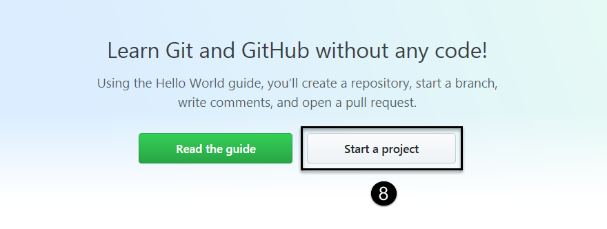

9. **Select** the "Start a project" button.

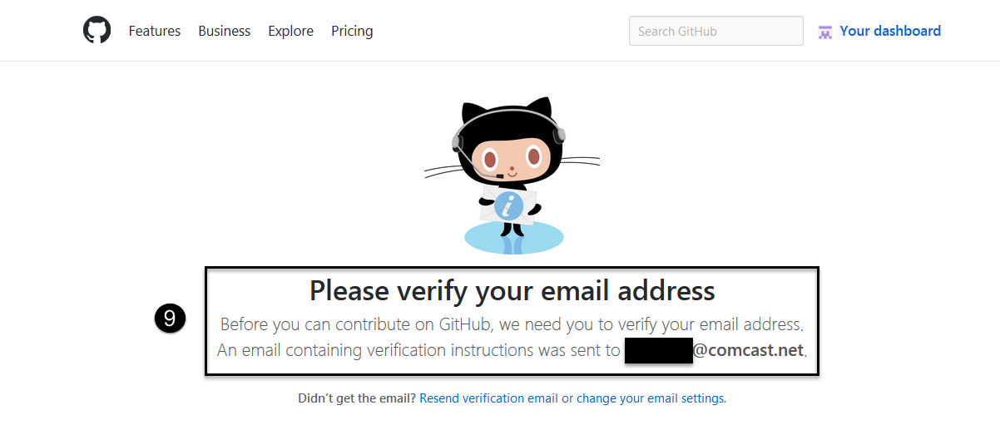

10. **Go to** the Email account you supplied during signup. Open the verification email sent to you by GitHub.

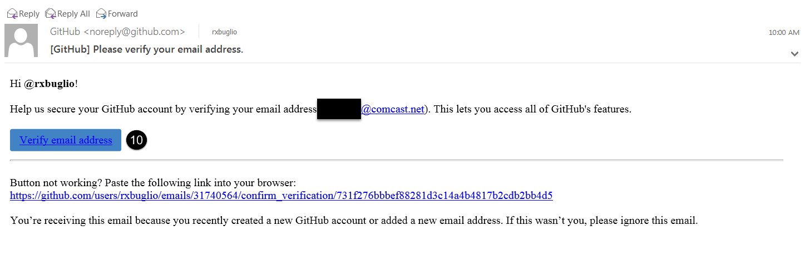

11. **Click On** the "Verify email address" link.

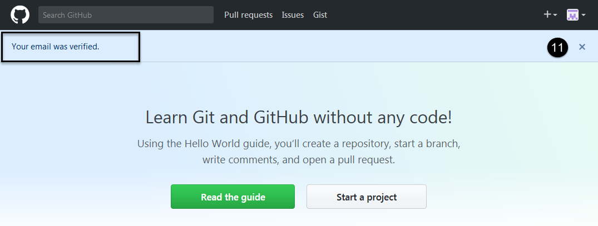

> You will be brought to a web page notifying you that your email was verified. 

12. **Select** the "X" in the top right corner to close the verification message.

> Your have completed all of the required pre-requisite steps. You can now proceed to the Data Enginner lab to get started.

## [Click Here to go to the Data Engineer Lab](https://github.com/WatsonDataPlatform/E2ELab/tree/master/dataengineer/)
