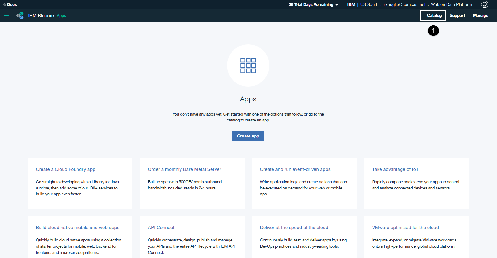
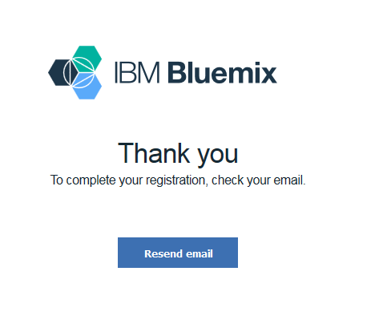
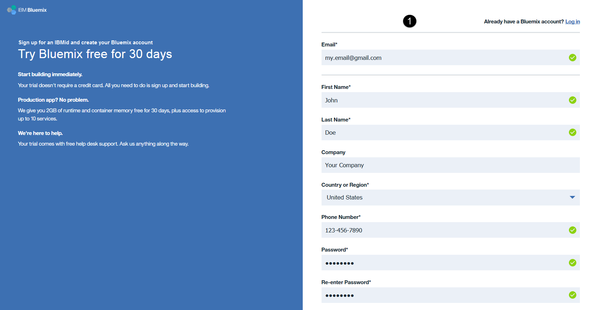
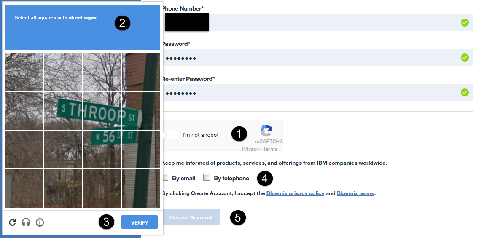
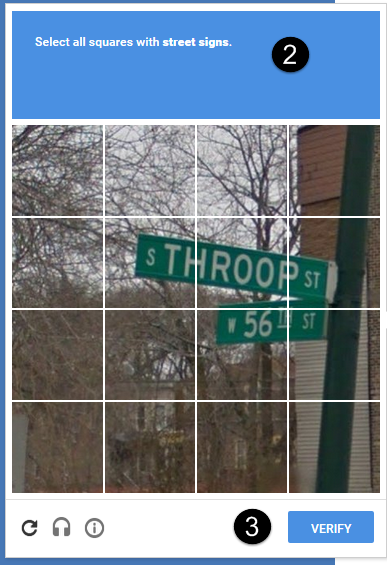
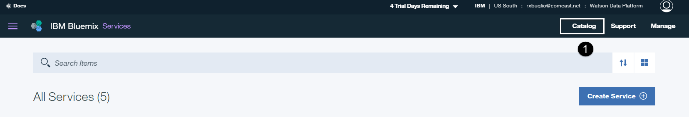
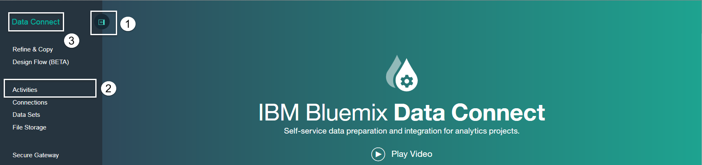

## Before You Begin

The "Watson Data Platform" lab is done using the IBM cloud. It uses a set of fully managed cloud data services; Cloudant and dashDB for Analytics to persist data and Data Connect to ingest data. These services are available in Bluemix, IBM’s cloud platform as a service (PaaS). It also uses Watson Analytics, IBM’s smart data discovery service on the cloud and the IBM Data Science Experience, an interactive, collaborative, cloud-based environment where data scientists can use multiple tools to activate their insights. Lastly, this lab requires that you download a set of files that you will use as your source data and to build your application.

## Workflow

On the following pages are a series of steps you will perform before you do any of the labs. Each step outlines an easy to follow set of instructions that will walk you through preparing your IBM cloud environment so you can do any of the labs you choose. It is a serial process so it’s important that you follow each step in sequence and do not deviate from the workflow or skip any steps in the process.

Step | Description
------------ | -------------
1 | Download the Lab Files
2 | Create a Bluemix Account
3 | Create the Cloud Data Services
4 | Create the Cloud Application
5 | Create a Watson Analytics Account

## Step 1: Download the Lab Files

Please **Download** the Great Outdoor Customer Orders CSV file that is used in the Data Engineer and Business Analysis labs to your workstation and remember where you saved it to:

### [Click Here to Download the "Great Outdoor Customer Orders.csv" file](https://github.com/WatsonDataPlatform/E2ELab/blob/master/GettingStarted/Great%20Outdoor%20Customer%20Orders.csv)

Please **Download** the nodejsDashboard Zip file that is used in the Application Developer lab to your workstation and remember where you saved it to:

### [Click Here to Download the "nodejsDashboard.zip" file](https://github.com/WatsonDataPlatform/E2ELab/blob/master/GettingStarted/nodejsDashboard.zip)

## Step 2: Create a Bluemix Account

You will need a Bluemix account. Follow the instructions in one of the sections below depending on whether or not you have a Bluemix account.

## If you alredy have a Bluemix account

### [Click Here to Login to Bluemix](https://console.ng.bluemix.net/)

> **Note** - The URL for Bluemix is https://console.ng.bluemix.net

1. **Select** the "Log In" button. When prompted, enter your Bluemix ID and password.

## If you don't have a Bluemix account

### [Click Here to Register for a Bluemix Account](https://console.ng.bluemix.net/registration/)

Fill in the required information (required fields are marked with an asterick) on the right side panel and then click the *Create Account* button on the bottom of the panel.

You will see a page asking you to check your email for next steps. Check your email account that you used when you registered for your Bluemix account.

Click on the “confirm your account” link.

## Step 2: Create a Watson Analytics Account

You will need a Watson Analytics account. If you don't have an account, click on the URL below to create one:

  > https://watson.analytics.ibmcloud.com/product
  >
  > Click on the “TRY IT FOR FREE” button. You have the option to click on “View pricing and buy” from the next screen. Watson Analytics provides 2 paid editions “Plus” and “Professional” with monthly license charges of $30 and $80, with included storage of 2GB and 100GB respectively. For now, you will go with the “Free” license and click on “Try free edition”.

1.  Open a browser and go to “watsonanalytics.com”. This will redirect you to the URL: <https://watson.analytics.ibmcloud.com/product> and click on “TRY IT FOR FREE” button as shown below:

   
2.  You have the option to click on “View pricing and buy” from the next screen. Watson Analytics provides 2 paid editions “Plus” and “Professional” with monthly license charges of $30 and $80, with included storage of 2GB and 100GB respectively. For now, let’s go with the “Free” license and click on “Try free edition”. To read more about the editions, please check out: <https://www.ibm.com/analytics/watson-analytics/us-en/solution/editions>

3.  You will be taken to the “Purchase” page, from where click on “Try free edition”. This will set up a “Free” account that supports 1MB of storage for a single user for an indefinite period and a 30-day trial of the Professional single user account. The “Free” account only allows text files to be uploaded into Watson Analytics, whereas from Professional Account you can bring in a variety of data sources on the cloud and on-premise with up to 100GB of storage (additional storage can be purchased at $50 per month per 50GB).

4.  You will now be prompted to setup an IBMid using the sign-up form as shown below. However, if you already have an IBMid, you can click on “Already have an IBMid” as highlighted below and sign-on with those credentials to request Watson Analytics account setup.

5.  To activate your IBMid, you will be sent an email by ibmacct@us.ibm.com with a “Confirmation code” (7 digit number), that you can retrieve from your email box and type it on the sign-up page as shown below.

6.  At this point, you will see a status screen saying “Your services are being setup” but within a few seconds your account will be setup and you’ll see a page as below confirming your 30-day trial subscription to “IBM Watson Analytics Professional Single User”!

## Step 3: Login to Bluemix

## [Click Here to Go to Bluemix](https://console.ng.bluemix.net/)

> **Note** - The URL for Bluemix is https://console.ng.bluemix.net

1. **Select** the "Log In" button. When prompted, enter your Bluemix ID and password.

## Step 4: Create a Bluemix Space

  

1. **Select** the Account information area in the top right corner of your Bluemix account home page.
2. **Select** the "Create a Space" link next to “Manage Organizations” below the Space drop down list box.

  

3. **Enter** “Watson Data Platform” (without quotes) for the space name.  
4. **Select** the “Create” button.  

> Your space will be created and you will be taken into your new space. You should now see, in the top right corner, that you are in the “Watson Data Platform” space in your Bluemix organization. You will use this space to house the Data Connect service that you will be creating in the following section.

## Step 7: Create a Data Connect Service

1. **Select** the "Catalog" menu at the top of the Bluemix home page.  
2. **Select** the "Data and Analytics" category from the categories on the left.  
3. **Click on** the “Data Connect” service from the list of services on the right.  

4. **Enter** "Data Connect” (without quotes) for the Service name.  
5. **Enter** “Data Connect” (without quotes) for the Credential name.  
6. **Select** the “Starter” plan from the Pricing Plans section (it is typically selected by default).  
7. **Select** the the "CREATE" button. The service will be created and the launch page is displayed.  

8. **Select** the “LAUNCH” button to start using Bluemix Data Connect - It will open in a new tab in your browser.

> The Data Connect user interface provides easy access to all functions from a main menu located on the left side and a few primary functions that are displayed in the middle of the home page that allow you to navigate to the different areas of the interface.

> **Notice** that there is a menu control button to the right of the Data Connect logo. It controls the appearance of the menu on the left side. By selecting this button you can hide or view the left side menu. Also, clicking on the service name you can always get back to the home page. Let’s experiment with these controls.

1. **Select** the menu control button. The menu will disappear. Select it again and the menu will reappear.  
2. **Select** the Activities menu item. It will take you to the Activities section of the interface.  
3. **Select** the Data Connect service name to get back to the home page.
