## Hands on Lab - Application Development

As an Application Developer, you need multiple application and data services that facilitate a modern architecture and delivery practices around mobile, microservices, DevOps and continuous delivery. Perform hands-on exercises to quickly build and deploy a live dashboard with Node.js connceted to a document data service, IBM Cloudant NoSQL DB.

##Lab Components: IBM Bluemix Cloud Offering Used

1.  **Source Data Repository**: **Cloudant NoSQL DB**

2.  **Software Development Tools**: **DevOps Services and Git **

3.  **Runtime Environment**: **SDK for Node.js**

This lab will demonstrate how an applicaiton developer can easily build and deploy a Bluemix application using: 

* Working with a Cloudant NoSQL database
* Persisting data into a Cloudant NoSQL database
* Preparing the WDP Lab Application
* Executing and monitoring data activities
* Persiting data into Watson Analytics

## Workflow

> On the following pages are a series of steps to complete this lab sucessfully. Each step outlines an easy to follow set of instructions that demonstrate the capabilities of the Bluemix Data Connect cloud service. It has been designed as a serial process so it’s important that you follow each step in sequence and do not deviate from the workflow or skip any steps in the process.

### Lab Steps

Step | Description
------------ | -------------
1 | Launch the Cloudant NoSQL DB Service
2 | Setup the Cludant NoSQL Database
3 | Prepare the Watson Data Platform Application
4 | Prepare the Data
5 | Complete and Run the Data Activity
6 | Validate the Results

## Step 1: Launch the Cloudant NoSQL DB Service

### [Click Here to Go to Bluemix](https://console.ng.bluemix.net/)

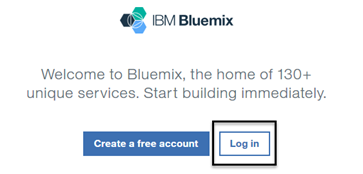

> You should be logged into your Bluemix account if you just completed the GettingStarted section. If not, select the Log in button. When prompted, supply your credentials to log into your Bluemix account.

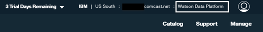

> Make sure you are in the "Watson Data Platform" space.

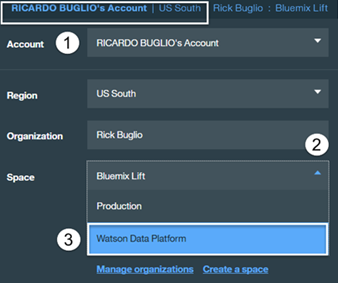

> If you are not in the "Watson Data Platform" space, that you were instructed to create in the GettingStarted section, switch to it by **Selecting** the Bluemix region / organization area in the top right corner of the Bluemix home page as decpicted in the screen shot above.

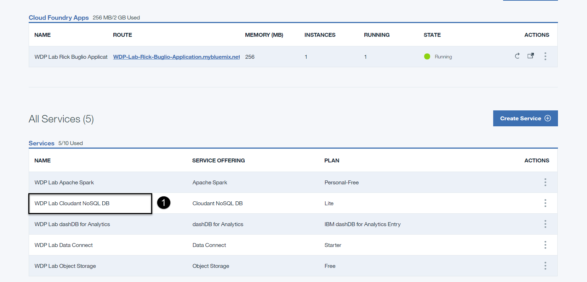

1. Once you are logged into your Bluemix account, **Scroll down** to the "All Services" section of your dashboard and **Click** on the "WDP Lab Cloudant NoSQL DB" service. You will be brought to the Cloudant NoSQL DB launch page.

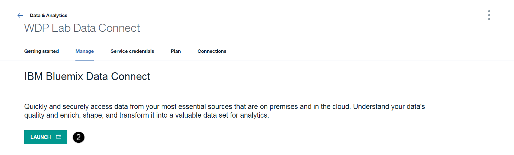

2. **Select** the “LAUNCH” button to start using the Cloudant NoSQL DB service. It will open in a new tab in your browser.

## Step 2: Setup the Cloudant NoSQL Database

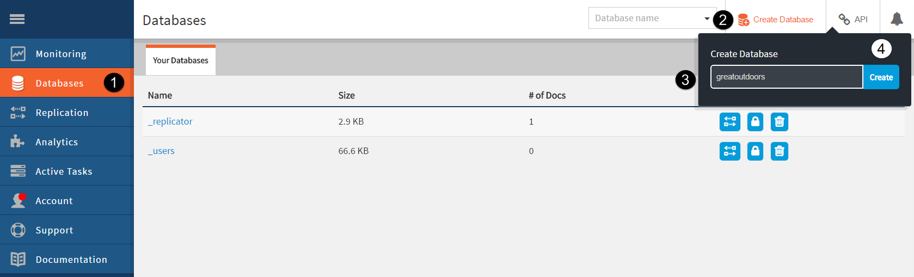

1. **Select** the "Databases" tab from on the left side menu.
2. **Select** "Create Databases" from the top navigation bar.
3. **Enter** "greatoutdoors" (in lowercase, database names are case sensitive) for the database name.
4. **Select** the "Create" button.

> Note - In the following steps we will create two indices to allow queries against the data set. Any parameter which is used in a query must be indexed.

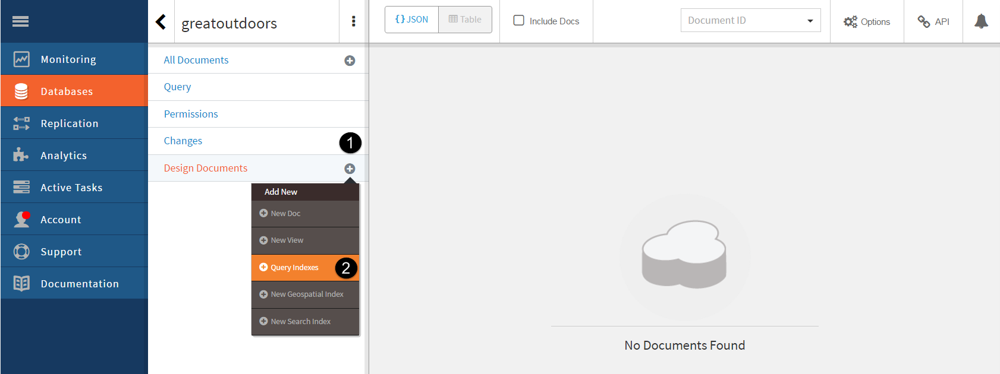

1. **Select** the "+" sign on "Design Documents" menu.
2. **Select** the "Query Indexes" menu item.

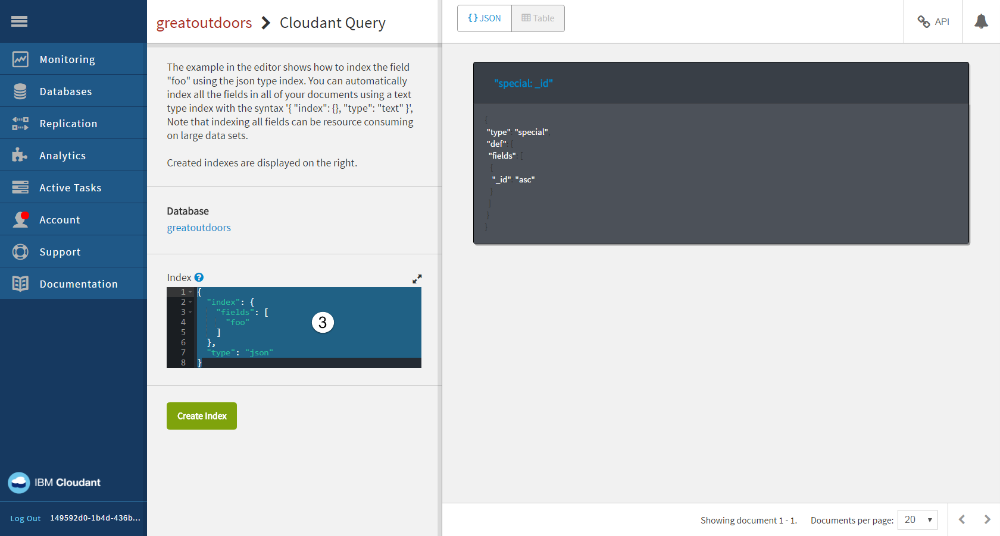

3. **Click** in the "Index" text box and select all the text.

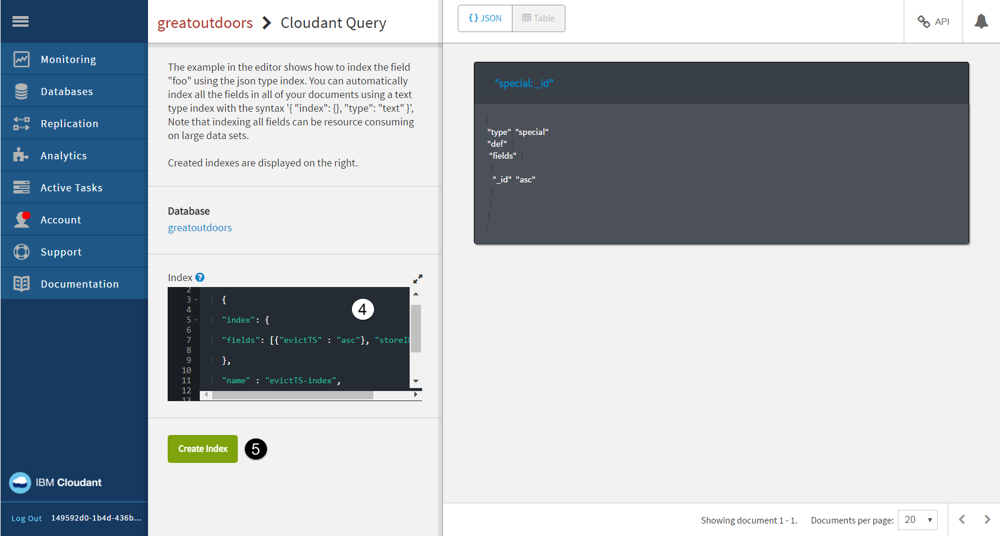

4. **Replace** the text with the following text:

 > {
 >
 > "index": {
 >
 > "fields": \[{"evictTS" : "asc"}, "storeID", "zoneID"\]
 >
 > },
 >
 > "name" : "evictTS-index",
 >
 > "type" : "json"
 >
 > }

5. **Select** the "Create Index” button.

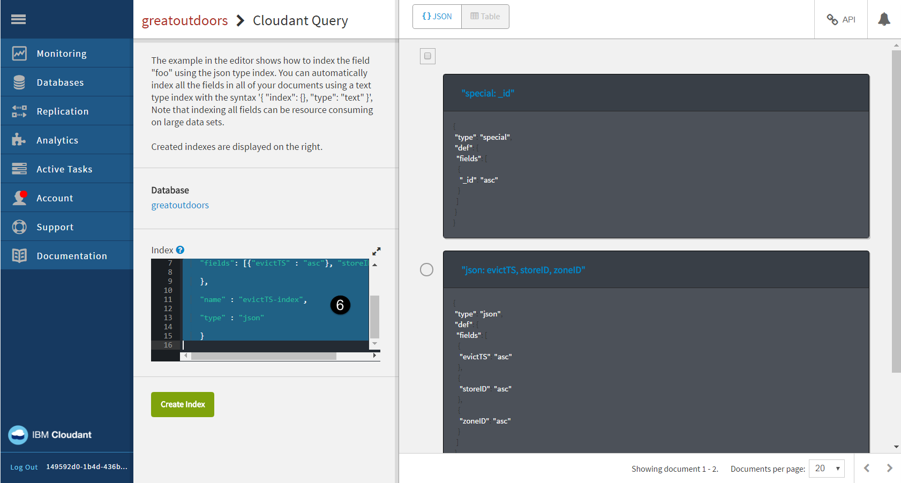

6. **Click** in the "Index" text box and select all the text.

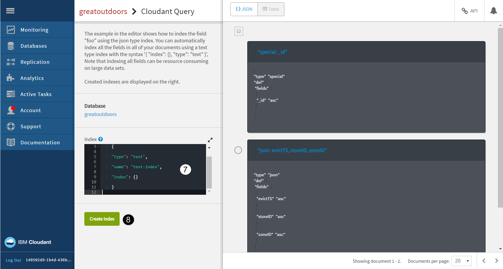

7. **Replace** the text with the following text:

 > {
 >
 > "type": "text",
 >
 > "name": "text-index",
 >
 > "index": {}
 >
 > }

8. **Select** the "Create Index” button.

 > Note: If the creation of either index fails, check to be sure that the double quotes have not been mangled by the copy-and-paste process. They should be standard double quotes and not inverted.

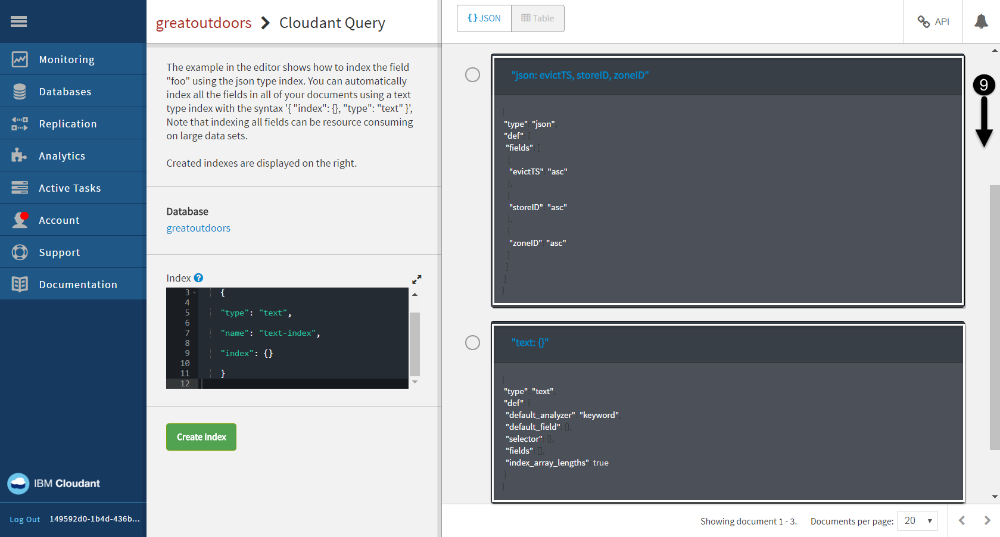

9. **Scroll down** the list of indicies on the right hand side.

 > You shoud now see the two indicies you just created.

## Step 3: Prepare the Watson Data Platform Application

 > Go back to your Bluemix account. It should still be opened in your browser and you should be logged in and on the Cloudant NoSQL DB launch page.

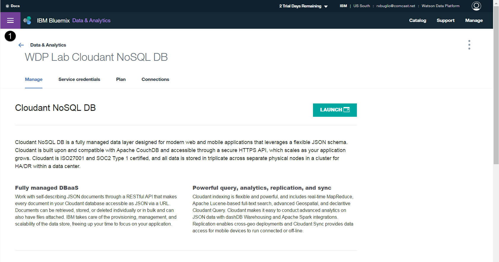

1. **Select** the Hamburger in the top left corner of Bluemix to view the Bluemix menu items.

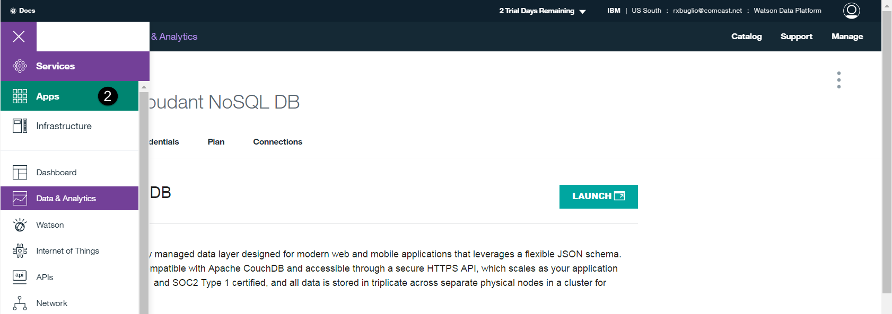

2. **Select** the "Apps" meu item.

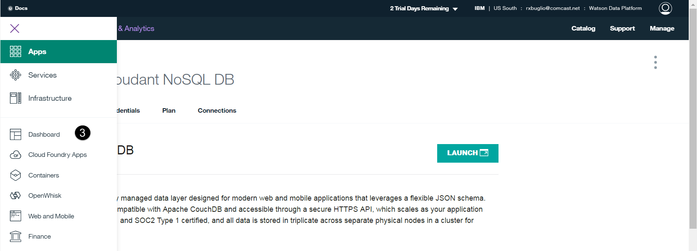

3. **Select** the "Dashboard" sub-menu to get back to your Bluemix dashboard.

6.  Click on the “**Connections**” tab in the top navigation bar when staging is complete.

    a.  Click on the blue “**Connect Existing**” button on the top, right side of the page.

    b.  Click on the **NoSQL Cloudant DB** service you created in section 4 and click **Connect**

    c.  You will be prompted to restage your application. Click **Restage**.

    d.  *Note: Allow 30-40 seconds for your application to restage.*

    e.  Binding services allows the Node.js service to authenticate to Cloudant without hard coding credentials in the JavaScript code. It uses environment variables on the server-side to share the credentials between services.

7.  In the top, navigation bar click the “**Overview**” tab.

    a.  In the Continuous Delivery panel select “**Add Git Repo and Pipeline**”

    b.  If you already have a jazz.net account bind with that account. Otherwise, enter a n alias (account name) to allow Bluemix to create a Dev Ops account for you.

    c.  Accept the DevOps Services terms by ticking the box.

    d.  Click **Create**

    e.  Once your Git account has been created you will be notified. Click **Continue**

    f.  Once the Git repo has been create you will be prompted:

 > *Populate the repo with the starter app package and enable the Build & Deploy pipeline?*

	g.  **Tick the box** and click **Continue**

	h.  Once the Git repo is created you will be notified. Click **Close**

	i.  In the Continuous Deliver panel select **Configure**

	j.  You should see two stages which have been created for you. One for Build and the other for Deploy.

8.  DevOps Service for Bluemix

    a.  Click on the settings “star” icon for the **Build Stage** and select **Configure Stage**.

    b.  Select **Input** tab

    c.  At the bottom of the screen change “**State Trigger**” from “Run jobs whenever a change is pushed to Git” to “Run jobs only when this stage is run manually”.

    d.  Click “**Save**”

9.  Return to your Git repo

    a.  Select “**Edit Code**” on the top navigation bar

    b.  In the left-hand pane click on the top entry with the twisty icon. We are going to import code and it is important that we import it to the root of the folder.

    c.  In the Application Menu select File -&gt; Import -&gt; File or Zip Archive

    d.  Browse to the zip file you downloaded in the Before You Begin section.

    e.  You will be prompted if it should unzip the .zip file. Click **OK**.

    f.  The import will fail and then ask *“Would you like to retry the import with force overwriting?*”. If you are not prompted the import may have failed.

    g.  Click **Yes**.

    h.  You will need to edit **Manifest.yml** to change the location where the application is hosted. Change both occurrences of NodejsDashboard to the name of your mybluemix.net host route. The host is usually the same name as your project unless there was a conflict. Note: The file will save automatically.

10.  In the left-hand navigation bar click the **Git** icon  just below “**edit code**”

    a.  Allow the page to completely refresh all the code changes. You should see 11 files selected in the right-hand pane.

    b.  Enter a comment into the comment window and click **Commit**.

    c.  In the **Outgoing** source tab on the left side of the page click **Push**. This will deliver (push) the commits to the server.

11.  DevOps Service for Bluemix

    a.  Select **Build and Deploy** on the top navigation bar

    b.  Click the play button on the **Build stage** to build the newly delivered code. If the build is successful the Deploy stage should start automatically and deploy your code to the server.

    c.  Once the Deploy stage has completed and passed, right click on the application URL and **open in a new browser tab** by right clicking on the URL.

12.  Node.js runtime Service

    a.  Browse to your mybluemix.net URL where your web application is hosted. You should see a d3.js graph with 5 bars representing the 5 zones in the store.

    b.  After 30 seconds, the application should read from the Cloudant database and the values for each store should change.

***End of Lab***
