## Hands on Lab - Application Development

As an Application Developer, you need multiple application and data services that facilitate a modern architecture and delivery practices around mobile, microservices, DevOps and continuous delivery. The hands-on exercises in this lab will instruct you on how to quickly build and deploy a live dashboard application with Node.js connceted to a document data service, IBM Cloudant NoSQL DB. It analyzes data stored in the Cloudant document data service and renders a web interface that displays a graph depicting where time is being spent across the different departments of the Great Outdoors retail store.

## Prerequisites

> Make sure you have completed the prerequisites in the GettingStarted section for the labs before you proceed.
> ### [Click Here to go to GettingStarted](https://github.com/WatsonDataPlatform/E2ELab/tree/master/GettingStarted/)

## Workflow

> On the following pages are a series of steps to complete this lab sucessfully. Each step outlines an easy to follow set of instructions that demonstrates how to build and deploy the "Watson Data Platform" application in Bluemix. It has been designed as a serial process so it’s important that you follow each step in sequence and do not deviate from the workflow or skip any steps in the process.

### Lab Steps

Step | Description
------------ | -------------
1 | Launch the Cloudant NoSQL DB Service
2 | Create and Setup a Cludant NoSQL Database
3 | Build and Deploy the Watson Data Platform Application

## Step 1: Launch the Cloudant NoSQL DB Service

### [Click Here to Go to Bluemix](https://console.ng.bluemix.net/)

> You should be logged into your Bluemix account if you just completed the GettingStarted section. If not, select the Log in button. When prompted, supply your credentials to log into your Bluemix account.

> Make sure you are in the "Watson Data Platform" space that you were instructed to create in GettingStarted.

> If you are not in the "Watson Data Platform" space, switch to it.
1. **Click on** the Bluemix "Organization | Region" area in the top right corner of the Bluemix home page.
2. **Click on** the Space dop down arrow.
3. **Select** the "Watson Data Platform" space.

1. Once you are logged into your Bluemix account, **Scroll down** to the "All Services" section of your dashboard and **Click** on the "WDP Lab Cloudant NoSQL DB" service. You will be brought to the Cloudant NoSQL DB launch page.

2. **Select** the “LAUNCH” button to start using the Cloudant NoSQL DB service. It will open in a new tab in your browser.

## Step 2: Create and Setup a Cloudant NoSQL Database

1. **Select** the "Databases" tab from on the left side menu.
2. **Select** "Create Databases" from the top navigation bar.
3. **Enter** "greatoutdoors" (in lowercase, database names are case sensitive) for the database name.
4. **Select** the "Create" button.

> **Note** - In the following steps we will create two indices to allow queries against the data set. Any parameter which is used in a query must be indexed.

1. **Select** the "+" sign on "Design Documents" menu.
2. **Select** the "Query Indexes" menu item.

3. **Click** in the "Index" text box and select all the text.

4. **Replace** the text with the following text:

 > {
 >
 > "index": {
 >
 > "fields": \[{"evictTS" : "asc"}, "storeID", "zoneID"\]
 >
 > },
 >
 > "name" : "evictTS-index",
 >
 > "type" : "json"
 >
 > }

5. **Select** the "Create Index” button.

6. **Click** in the "Index" text box and select all the text.

7. **Replace** the text with the following text:

 > {
 >
 > "type": "text",
 >
 > "name": "text-index",
 >
 > "index": {}
 >
 > }

8. **Select** the "Create Index” button.

 > Note: If the creation of either index fails, check to be sure that the double quotes have not been mangled by the copy and paste process. They should be standard double quotes and not inverted.

9. **Scroll down** the list of indicies on the right hand side.

 > You shoud now see the two indicies you just created.

## Step 3: Build and Deploy the Watson Data Platform Application

 > Go back to your Bluemix account. It should still be opened in your browser and you should be logged in and on the Cloudant NoSQL DB launch page.

1. **Select** the Hamburger in the top left corner of the Bluemix home page to view the Bluemix navigation menu.

2. **Select** the "Apps" menu item.

3. **Select** the "Dashboard" sub-menu to go to the "All Apps" section of your Bluemix dashboard.

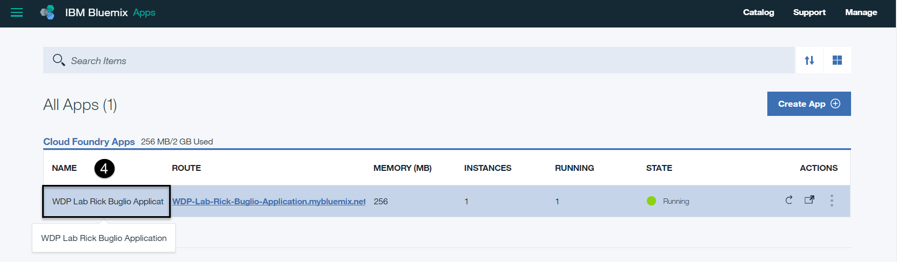

4. **Click on** the "WDP Lab *Your Name* Application" Name (not the Route URL) where *Your Name* is your First and Last name, that you created in GettingStarted.

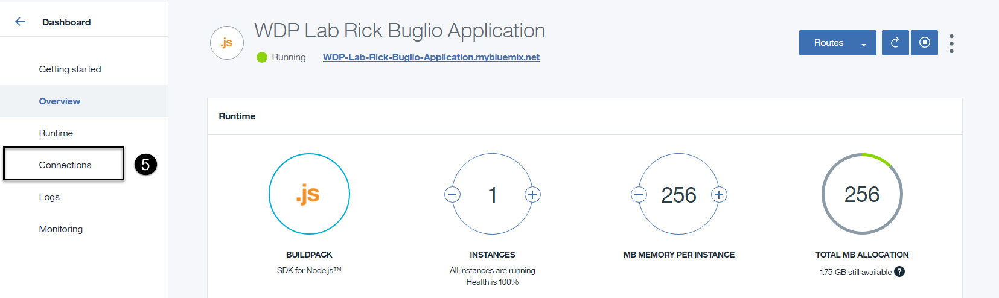

5. **Select** the “Connections” tab from the left side menu.
6. **Select** the "Connect existing" button.

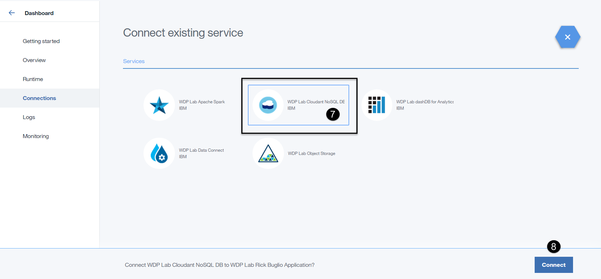

7. **Click on** the "WDP Lab Cloudant NoSQL DB" service existing" button.
8. **Select** the "Connect" button.

9. **Select** the "Restage" button when prompted.

> Note: Allow 30-40 seconds for your application to restage.

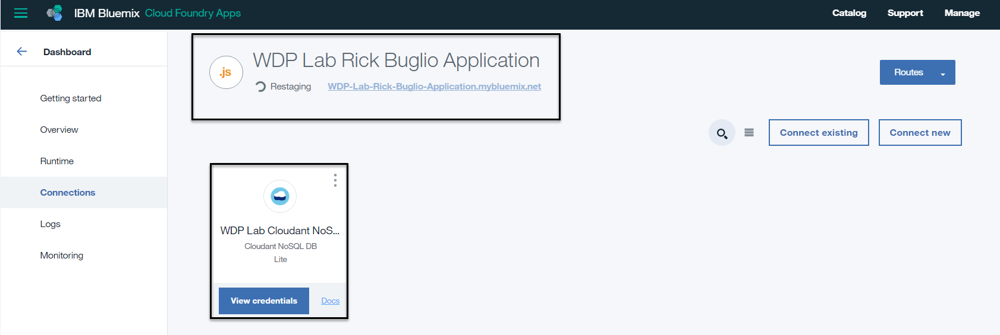

> You should now see your application in a staging status with a spinning wheel.

> Binding services to an application allows the Node.js service to authenticate to the Cloudant NoSQL DB service without hard coding credentials in the JavaScript code. It uses environment variables on the server side to share the credentials between services.

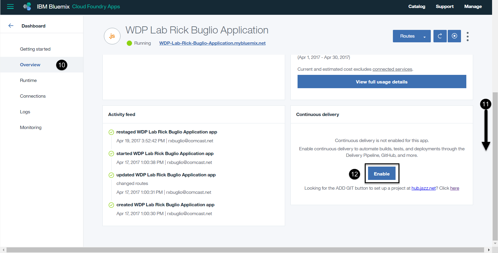

10. **Select** the "Overview" tab from the left side menu.
11. **Scroll down** to the bottom of the "Overview" page.
12. **Select** the "Enable" button from the Continuous Delivery section in the bottm right corner.

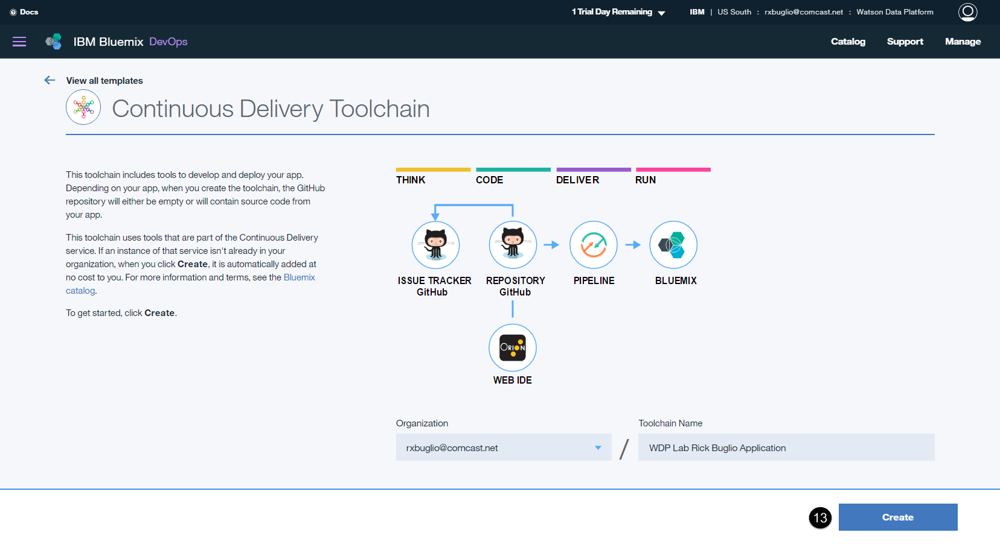

> A new tab will open in your browser and you will be brought into IBM Bluemix DevOps to create a toolchain. This toolchain includes tools to develop and deploy your app. Depending on your app, when you create the toolchain, the GitHub repository will either be empty or will contain source code from your app. 

> This toolchain uses tools that are part of the Continuous Delivery service. If an instance of that service isn't already in your organization, when you click Create, it is automatically added at no cost to you.

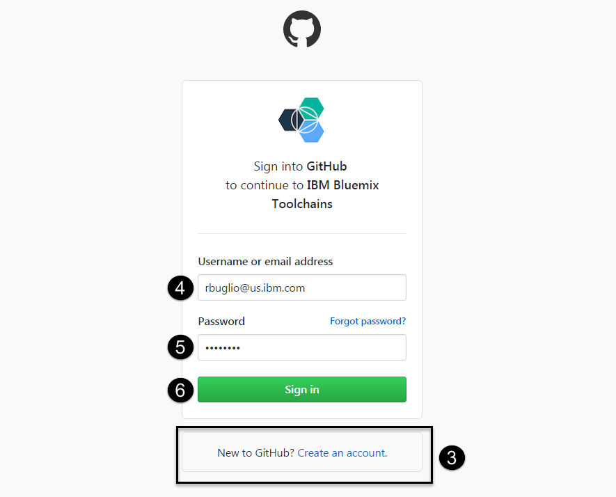

1. **Scroll down** the page until you see the Tool Integrations section.
2. **Click on** the GitHub integration link.
3. **Select** the "Authorize" button. This will take you into a login page to log into or create a GitHub account. 

> You will need a GitHub account to manage your application code.  Follow one of the paths below depending on whether or not you have an existing GitHub account or not.

If you already have a GitHub account:

1. **Enter** your GitHub Username or email address.
2. **Enter** your password.
3. **Select** the "Sign in" button.

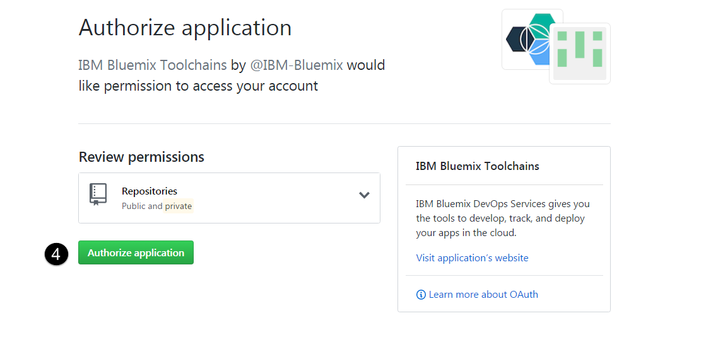

4. **Select** the "Authorize application" button.

If you are New to GitHub and **do not** have a GitHub account:

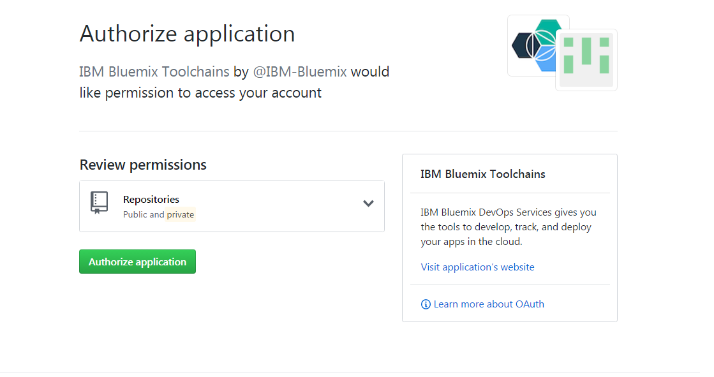

1. **Select** the "Create an account" button.

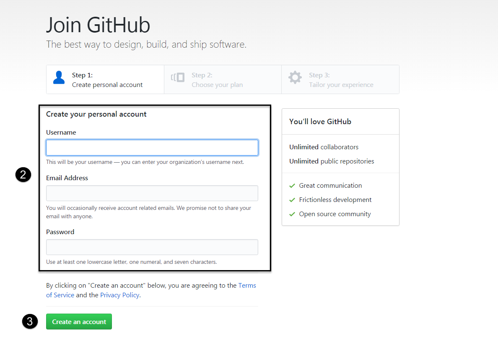

2. **Enter** the required information; Username, Email Address and Password
3. **Select** the "Create an account" button.

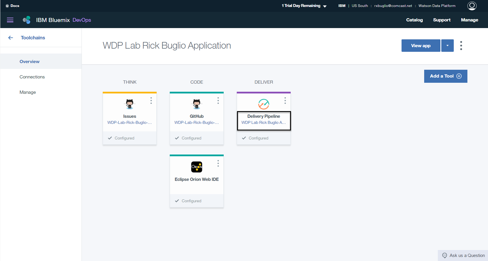

4. **Select** the "Create" button at the botton of the page to create the toolchain.

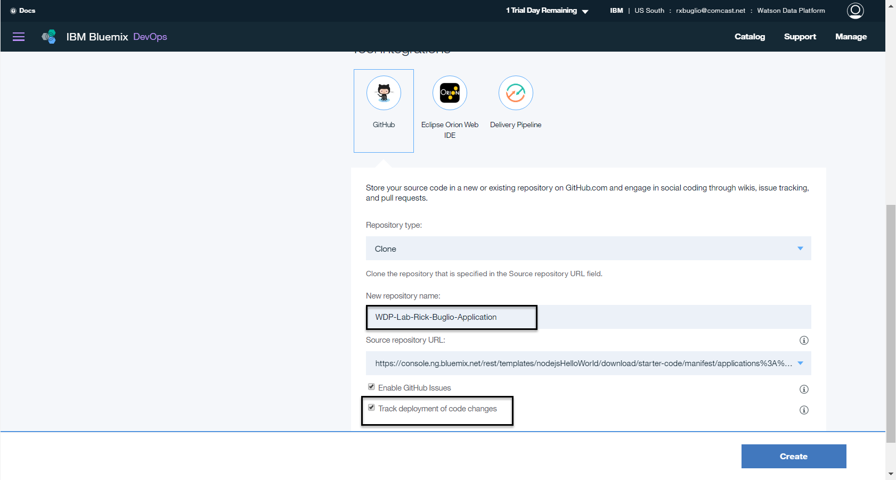

5. **Select** the "Create" button at the botton of the page to create the toolchain.

6. **Select** the "Create" button at the botton of the page to create the toolchain.

 > *Populate the repo with the starter app package and enable the Build & Deploy pipeline?*

	g.  **Tick the box** and click **Continue**

	h.  Once the Git repo is created you will be notified. Click **Close**

	i.  In the Continuous Deliver panel select **Configure**

	j.  You should see two stages which have been created for you. One for Build and the other for Deploy.

8.  DevOps Service for Bluemix

    a.  Click on the settings “star” icon for the **Build Stage** and select **Configure Stage**.

    b.  Select **Input** tab

    c.  At the bottom of the screen change “**State Trigger**” from “Run jobs whenever a change is pushed to Git” to “Run jobs only when this stage is run manually”.

    d.  Click “**Save**”

9.  Return to your Git repo

    a.  Select “**Edit Code**” on the top navigation bar

    b.  In the left-hand pane click on the top entry with the twisty icon. We are going to import code and it is important that we import it to the root of the folder.

    c.  In the Application Menu select File -&gt; Import -&gt; File or Zip Archive

    d.  Browse to the zip file you downloaded in the Before You Begin section.

    e.  You will be prompted if it should unzip the .zip file. Click **OK**.

    f.  The import will fail and then ask *“Would you like to retry the import with force overwriting?*”. If you are not prompted the import may have failed.

    g.  Click **Yes**.

    h.  You will need to edit **Manifest.yml** to change the location where the application is hosted. Change both occurrences of NodejsDashboard to the name of your mybluemix.net host route. The host is usually the same name as your project unless there was a conflict. Note: The file will save automatically.

10.  In the left-hand navigation bar click the **Git** icon  just below “**edit code**”

    a.  Allow the page to completely refresh all the code changes. You should see 11 files selected in the right-hand pane.

    b.  Enter a comment into the comment window and click **Commit**.

    c.  In the **Outgoing** source tab on the left side of the page click **Push**. This will deliver (push) the commits to the server.

11.  DevOps Service for Bluemix

    a.  Select **Build and Deploy** on the top navigation bar

    b.  Click the play button on the **Build stage** to build the newly delivered code. If the build is successful the Deploy stage should start automatically and deploy your code to the server.

    c.  Once the Deploy stage has completed and passed, right click on the application URL and **open in a new browser tab** by right clicking on the URL.

12.  Node.js runtime Service

    a.  Browse to your mybluemix.net URL where your web application is hosted. You should see a d3.js graph with 5 bars representing the 5 zones in the store.

    b.  After 30 seconds, the application should read from the Cloudant database and the values for each store should change.

***End of Lab***
