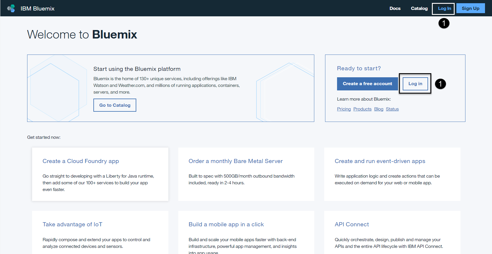
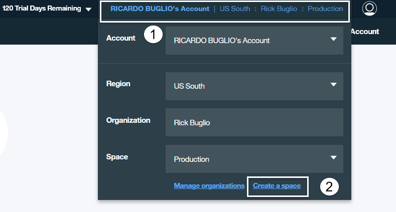
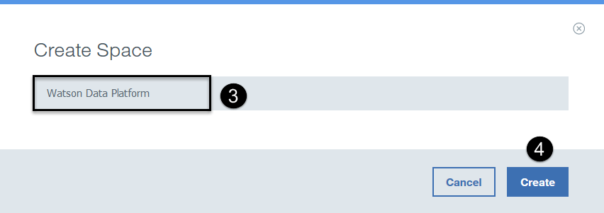

#Hands on Lab - Data Engineer

As a Data Engineer, you are constantly challenged with the expediated task of delivering quality, trusted data to business users, data scientists and application developers. Time is always of the essence, so you need the ablity to quickly and easily find, access, combine, cleanse, standardize and prepare data and then deliver it to those who need it when they need it in support of business analytical and application use cases. 

The IBM Bluemix Data Connect service, an intergral part of the Watson Data Platform, helps tackle these challenges.

Bluemix Data Connect is a fully managed, self-service, data preparation and integration service which enables you to easily make data fit for use. It provides instant access to your data wherever it resides, on the cloud or on-premises. You can blend data together from multiple relevant data sources to create powerful insights and then refinine and cleanse it using a robust catalog of transformation operations and then deliver it, with confidence, to one of many supported cloud or on-premises targets.

Data Connect is fully managed by IBM in the cloud, so you can sleep better at night, with Pay-as-you-go and subscription pricing options to get started quickly. It’s powered by Spark for a speedy and responsive experience and can easily integrate data across different platforms and is seamlessly integrated with Watson Analytics. Bluemix Data Connect empowers non-technical and technical users to simply put data to work.

With Data Connect, Data Engineers can enable self-service data access to end users using elastic deployment through the cloud and delver the data faster while maintaining important controls such as data governance and security. This allows them to break free from routine data requests and focus on additional value for an organization such as implementing and enforcing corporate standards, security, data governance and complex requirements. Data Connect saves time and resources by reducing the effort to provision trusted data and make it fit for use.

This lab will demonstrate how a data engineer can easily utilize these capabilities of the Data Connect service: 

* Creating and Working with the Bluemix Data Connect service
*	Creating and Working with Bluemix Data Connect Connections
*	Visualizing and Understanding Data Quality and Content
*	Preparing and Standardizing Data
*	Executing and Monitoring Data Activities
* Persiting data into Watson Analytics

##Before You Begin

> This lab is done on the web using Bluemix, IBM’s Cloud Platform-As-a-Service and Watson Analytics, IBM’s premiere analytical SaaS. It also uses a supplied Excel file as the source data store. Perform the following steps before you proceed any further:

1. Download the Great Outdoor Customer Orders Excel file from the github.com location below and save the file to a location of your choice on your workstation:

 > https://github.com/WatsonDataPlatform/E2ELab/blob/master/dataengineer/Great%20Outdoor%20Customer%20Orders.xlsx

2. You will need a Bluemix account. If you don't have an account, click on the URL below to create one:

  > https://console.ng.bluemix.net/registration
  >
  > Fill in all information on the right side panel and then click on the *Create Account* button on the bottom of the right side panel.

3. You will need a Watson Analytics account. If you don't have an account, click on the URL below to create one:

  > https://watson.analytics.ibmcloud.com/product
  >
  > Click on the “TRY IT FOR FREE” button. You have the option to click on “View pricing and buy” from the next screen. Watson Analytics provides 2 paid editions “Plus” and “Professional” with monthly license charges of $30 and $80, with included storage of 2GB and 100GB respectively. For now, you will go with the “Free” license and click on “Try free edition”.

##Workflow

> On the following pages are a series of steps to complete this lab sucessfully. Each step outlines an easy to follow set of instructions and demonstrates the capabilities of the Bluemix Data Connect cloud service. It has been designed as a serial process so it’s important that you follow each step in sequence and do not deviate from the workflow or skip any steps in the process.

###Lab Steps

Step | Description
------------ | -------------
1 | Login to Bluemix
2	| Create a Bluemix Space
3	| Create a Data Connect Service
4	| Create a Watson Analytics Connection
5	| Import the Source Data File
6	| Access the Source Data File
7	| Review the Data Quality and Content
8	| Prepare the Data
9	| Complete the Data Activity
10| Validate the Results

##Step 1: Login to Bluemix

Using your preferred web browser, go to URL https://console.ng.bluemix.net

1. Select the "Log In" button on the toolbar in the top right hand corner of the Bluemix home page or in the “Ready to start?” section and login to your Bluemix account by supplying your Bluemix ID and password.

##Step 2: Create a Bluemix Space

 

1.  **Select** the "Create a Space" link next to “Manage Organizations” below the Space drop down list box.

2.  **Enter** “Watson Data Platform” for the space name.
3.  **Select** the “Create” button.

Your space will be created and you will be taken into your new space. You should now see, in the top right corner, that you are in the “Watson Data Platform” space in your Bluemix organization. You will use this space to house the Data Connect service that you will be creating in the following section.

##Step 3: Create a Data Connect Service

 
1.  **Select** the "Catalog" menu at the top of the Bluemix home page.
2.  **Select** the "Data and Analytics" category from the categories on the left.
3.  **Select** the “Data Connect” service from the list of services on the right.

4. 	**Enter** ”Data Connect” for the Service name.
5. 	**Enter** “Data Connect” for the Credential name.
6. 	**Select** the “Starter” plan from the Pricing Plans section (it is typically selected by default).
7. 	**Select** the "CREATE" button. The service will be created and the launch page is displayed.

Note – If for some reason you do not see the IBM Bluemix Data Connect launch page below select CTRL+R on your keyboard to refresh the page. It should refresh the service launch page and display the screen shot below.

8. 	**Select** the “LAUNCH” button to use Bluemix Data Connect. It will open in a new tab in your browser.

The Data Connect user interface provides easy access to all functions from a main menu located on the left side and a few primary functions that are displayed in the middle of the home page that allow you to navigate to the different areas of the interface.

> **Notice** that there is a menu control button to the right of the Data Connect logo. It controls the appearance of the menu on the left side. By selecting this button you can hide or view the left side menu. Also, clicking on the service name you can always get back to the home page. Let’s experiment with these controls.

1.  **Select** the menu control button. The menu will disappear. Select it again and the menu will reappear.
2. 	**Select** the Activities menu item. It will take you to the Activities section of the interface.
3. 	**Select** the IBM Bluemix Data Connect service name to get back to the home page.

##Step 4: Create a Watson Analytics Connection

##Step 5: Import the Source Data File

##Step 6: Access the Source Data File

##Step 7: Review the Data Quality and Content

##Step 8: Prepare the Data

##Step 9: Complete the Data Activity

##Step 10: Validate the Results

>This concludes the lab. Thank you for taking the time to go through it. I hope you found it useful and you know how a better understanding of the power of the Bluemix Data Connect service and how it can help you easily put your data to work for you.
