## Hands on Lab - Data Engineer

As a Data Engineer, you are challenged with the constant and expediated task of delivering quality, trusted data to business analytsts, data scientists and application developers. Time is always of the essence, so you need the ablity to quickly and easily find, access, prepare, cleanse and standardize data and deliver it to those who need it when they need it in support of business analytical and application use cases. 

The IBM Bluemix Data Connect service, an intergral component of the Watson Data Platform, helps tackle these challenges.

Bluemix Data Connect is a fully managed self-service, data preparation and integration service that empowers users to easily streamline analytical and application development projects to deliver insights faster and with increased accuracy. It provides a wide range of data access connectors to your most essential data sources wherever they reside; on the cloud or on-premises, so you can explore, combine, and shape your data to prepare it for analytics. Use it to positively impact the way your organization leverages valuable data resources - all from the convenience of the cloud.

Data Connect is managed by IBM in the cloud, so you can sleep better at night, with Pay-as-you-go and subscription pricing options to get started quickly. It’s powered by Spark for a speedy and responsive experience and can easily integrate data across different platforms and is seamlessly integrated with Watson Analytics. Bluemix Data Connect empowers non-technical and technical users to simply put data to work.

With Data Connect, Data Engineers can enable self-service data access to end users using elastic deployment through the cloud and delver the data faster while maintaining important controls such as data governance and security. This allows them to break free from routine data requests and focus on additional value for an organization such as implementing and enforcing corporate standards, security, data governance and complex requirements. Data Connect saves time and resources by reducing the effort to provision trusted data and make it fit for use.

This lab will demonstrate how a data engineer can easily utilize these capabilities of the Data Connect service: 

* Creating and working with the Bluemix Data Connect service
*	Creating and working with Bluemix Data Connect connections
*	Visualizing and understanding data quality and Content
*	Preparing and transforming data
*	Executing and monitoring data activities
* Persiting data into Watson Analytics

## Before You Begin

> This lab is done from the web using Bluemix, IBM’s Cloud Infrastructure and Platform As-a-Service and Watson Analytics, IBM’s premiere analytical Software-As-a-Solution. It also uses a supplied CSV file as a source dataset. Please perform the following steps before you proceed any further:

1. **Download** the Great Outdoor Customer Orders CSV file from the GitHub location below and save the file to a location of your choice on your workstation:

 > https://github.com/WatsonDataPlatform/E2ELab/blob/master/dataengineer/Great%20Outdoor%20Customer%20Orders.csv

2. You will need a Bluemix account. If you don't have an account, click on the URL below to register for one:

  > https://console.ng.bluemix.net/registration
  >
  > Fill in all information on the right side panel and then click on the *Create Account* button on the bottom of    the right side panel.

3. You will need a Watson Analytics account. If you don't have an account, click on the URL below to create one:

  > https://watson.analytics.ibmcloud.com/product
  >
  > Click on the “TRY IT FOR FREE” button. You have the option to click on “View pricing and buy” from the next screen. Watson Analytics provides 2 paid editions “Plus” and “Professional” with monthly license charges of $30 and $80, with included storage of 2GB and 100GB respectively. For now, you will go with the “Free” license and click on “Try free edition”.

## Workflow

> On the following pages are a series of steps to complete this lab sucessfully. Each step outlines an easy to follow set of instructions that demonstrate the capabilities of the Bluemix Data Connect cloud service. It has been designed as a serial process so it’s important that you follow each step in sequence and do not deviate from the workflow or skip any steps in the process.

### Lab Steps

Step | Description
------------ | -------------
1 | Login to Bluemix
2	| Create a Bluemix Space
3	| Create a Data Connect Service
4	| Create a Watson Analytics Connection
5	| Import the Source Data File
6	| Refine the Data
7	| Complete and Run the Data Activity
8 | Validate the Results

## Step 1: Login to Bluemix

Using your preferred web browser, go to URL https://console.ng.bluemix.net

1. **Select** the "Log In" button. When prompted, enter your Bluemix ID and password.

## Step 2: Create a Bluemix Space

  

1. **Select** the Account information area in the top right corner of your Bluemix account home page.
2. **Select** the "Create a Space" link next to “Manage Organizations” below the Space drop down list box.

  

3. **Enter** “Watson Data Platform” (without quotes) for the space name.  
4. **Select** the “Create” button.  

> Your space will be created and you will be taken into your new space. You should now see, in the top right corner, that you are in the “Watson Data Platform” space in your Bluemix organization. You will use this space to house the Data Connect service that you will be creating in the following section.

## Step 3: Create a Data Connect Service

1. **Select** the "Catalog" menu at the top of the Bluemix home page.  
2. **Select** the "Data and Analytics" category from the categories on the left.  
3. **Click on** the “Data Connect” service from the list of services on the right.  

4. **Enter** "Data Connect” (without quotes) for the Service name.  
5. **Enter** “Data Connect” (without quotes) for the Credential name.  
6. **Select** the “Starter” plan from the Pricing Plans section (it is typically selected by default).  
7. **Select** the the "CREATE" button. The service will be created and the launch page is displayed.  

8. **Select** the “LAUNCH” button to start using Bluemix Data Connect - It will open in a new tab in your browser.

> The Data Connect user interface provides easy access to all functions from a main menu located on the left side and a few primary functions that are displayed in the middle of the home page that allow you to navigate to the different areas of the interface.

> **Notice** that there is a menu control button to the right of the Data Connect logo. It controls the appearance of the menu on the left side. By selecting this button you can hide or view the left side menu. Also, clicking on the service name you can always get back to the home page. Let’s experiment with these controls.

1. **Select** the menu control button. The menu will disappear. Select it again and the menu will reappear.  
2. **Select** the Activities menu item. It will take you to the Activities section of the interface.  
3. **Select** the Data Connect service name to get back to the home page.

## Step 4: Create a Watson Analytics Connection

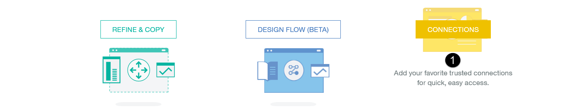

1. **Select** the “CONNECTIONS” button in the middle of the home page on the right.  
 
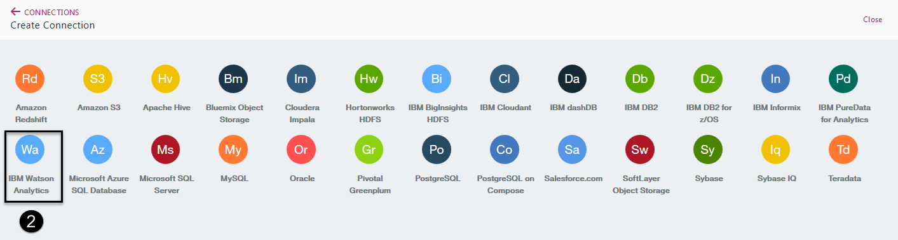

2. **Select** the “IBM Watson Analytics” connector from the list of supported connectors.

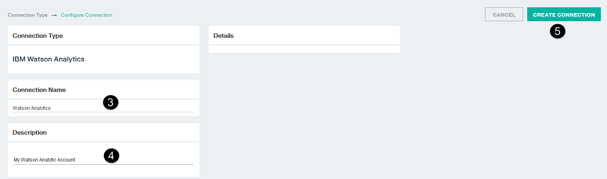

3. **Enter** "Watson Analytics" (without quotes) for the Connection name.  
4. **Enter** "My Watson Analytic Account" (without quotes) for the Description.  
5. **Select** the "Create Connection" button.

> **Note** - Data Connect uses OAuth2 to validate your Watson Analytics credentials. It uses your Bluemix credentials to log into Watson Analytics to authenticate you. During authentication, a new browser session will appear when Data Connect communicates with Watson Analytics to validate your credentials.
>
> If you have a Watson Analytics account that uses the same ID and password as your Bluemix account, Data Connect will validate your credentials and create the connection. If the ID is the same but the password is different you will be prompted to enter your password on a Watson Analytics login page, validate the credentials and create the connection. If you do not have a Watson Analytics account that matches your Bluemix ID you will get the error screen show below and you will not be allowed to create a Watson Analytics connection.

> If successful, you will receive a message that “The connection Watson Analytics was created.”

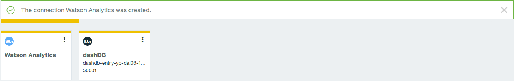

## Step 5: Import the Source File

  

1. **Select** the “File Storage” menu item from the left hand side main menu.

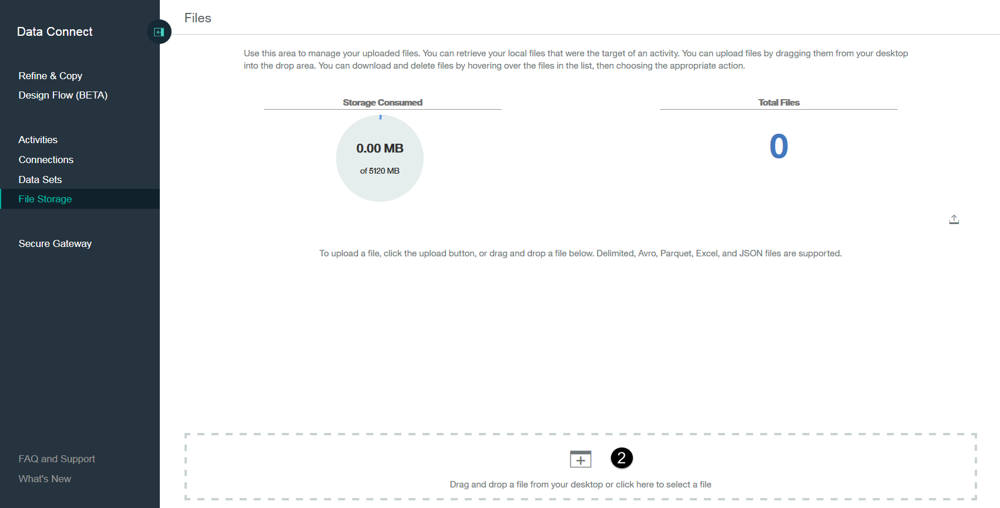  

2. **Select** the + Plus sign at the bottom of the “File Storage” page to add files.

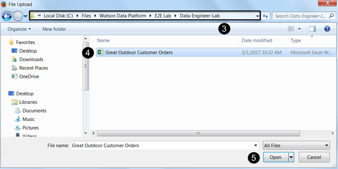  

3. **Navigate** to the location where you stored the lab source file "Great Outdoor Customer Orders.csv".  
4. **Select** the "Great Outdoor Customer Orders.csv" file.  
5. **Select** the “Open” button to import the file into Data Connect's object storage container.

## Step 6: Refine the Data

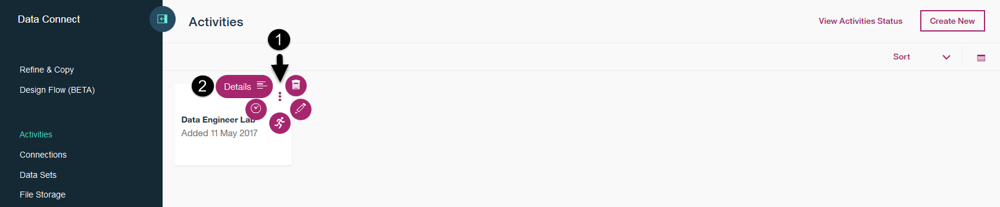  

1. **Select** the “Refine & Copy” menu item from the left side main menu.

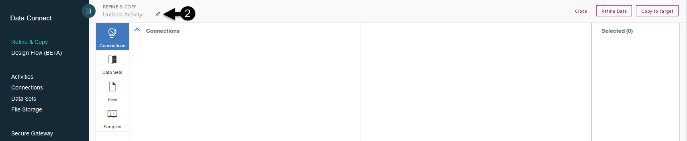  

2. **Hover over** the name area in the top left corner and **Select** the edit button that looks like a pencil.

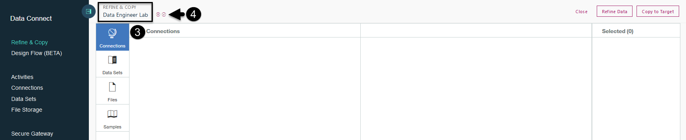  

3. **Click into** the name area and **Enter** a name of "Data Engineer Lab" (without quotes).  
4. **Select** the small check mark button next to the Activity name you just entered to save the new name.  

  

5. **Select** the “Files” section from Connections menu.  
6. **Select** the check box next to the "Great Outdoor Customer Orders.csv" file from the Files section.  
7. **Select** the the “Refine Data” button.

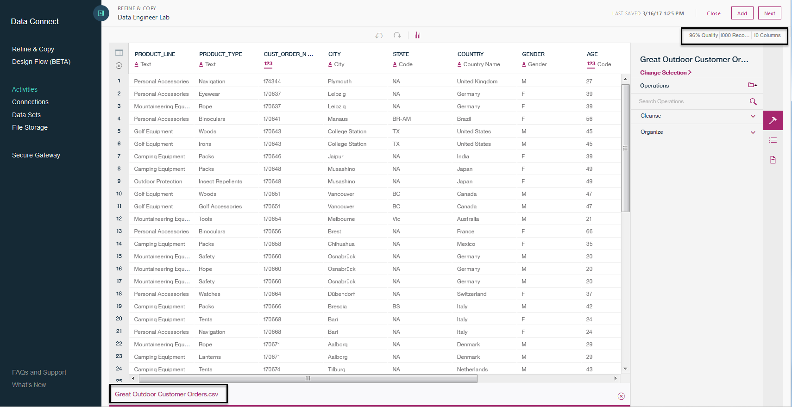

> You are brought into the Data Connect shaper. The file, Great Outdoor Customer Orders.csv, is selected by default and you are immediately presented with a quality score and some data metrics to help you understand the quality and content of the dataset before you begin refining it.
>
> **Notice** (highlighted above) that the quality score is in the top right corner of the shaper and the file names are at the bottom of the shaper.
 
### Review Quality and Content

> The object menu on the right simplifies the navigation process and provides easy access to Operations, History and Details at the table, file and column level. It provides a quality score for every table, file and column. The Operations section allows you to select and apply transformation functions at the table, file and column level. The History section is provided for you to review all actions you perform at the table, file and column level. The Detail section provides detailed quality and data content information for a table, file or column.

1.	**Select** the Details section for the Great Outdoor Customer Orders.csv file to review its quality and content.
2.	**Scroll down** to see all of the information provided.
3.	**Select** the menu control button in the top left hand corner to hide the Data Connect main menu.
 
### Review Column Metrics

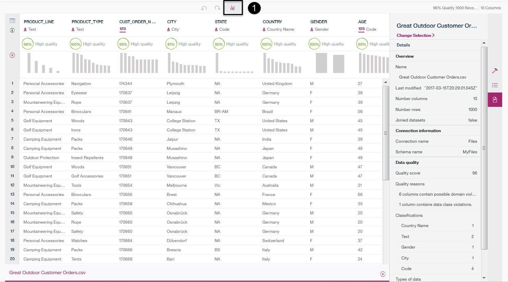

> The metrics view provides detailed quality and content metrics at the column level for every column in a table or file you have chosen to include in a refinement activity. You can toggle to the metrics view for any table or file to view column metrics.

1.	**Select** the “Toggle Metrics” button, the far right button on the shaper tool bar.

2.	**Select** the PRODUCT_LINE column - The column is highlighted and brought into context.
3.	**Notice** the Details section of the object menu changes to the PRODUCT_LINE column details.
4.	**Place your mouse** over the High Quality text of the PRODUCT_LINE column.

> **Note** You can do this for any column in the shaper.

5.	**Select** the “More information” link to get a more detailed explanation of the quality exceptions.
6.	**Select** the "Toggle Metrics" button on the shaper tool bar to get back to the data view.

### Prepare the Data

1.	**Select** the "Great Outdoor Customer Orders.csv" file to bring it into context.
2. **Select** the "Operations" button from the right side panel.
3.	**Select** the "Organize" menu from the object operations menu.
4.	**Select** the "Change schema" operation from the "Organize" menu.

1.	**Hover over** the name area of the PRODUCT_LINE column and Select the edit button that looks like a pencil to edit the name. Remove all the underscores from the column name and rename the column to PRODUCT LINE replacing all underscores with spaces.
2. **Hover over** the name area of the PRODUCT_TYPE column and Select the edit button that looks like a pencil to edit the name. Remove all the underscores from the column name and rename the column to PRODUCT TYPE replacing all underscores with spaces.
3. **Hover over** the name area of the CUST_ORDER_NUMBER column and Select the edit button that looks like a pencil to edit the name. Remove all the underscores from the column name and rename the column to CUSTOMER ORDER NUMBER changing CUST to CUSTOMER and replacing all underscores with spaces.
4. **Hover over** the name area of the MARITAL_STATUS column and Select the edit button that looks like a pencel to edit the name. Remove all the underscoreS from the column name and rename the column to MARITAL STATUS replacing all underscores with spaces.

> **Notice** that the column names have been changed and that each column name you changed has an edit icon next to it that looks like a pencil indicating that is has been edited.

5.	**Select** the "Apply" button at the bottom of the list of columns.

1.	**Select** the "Gender" column in the dataset grid.
2. **Select** the "String" menu from the object operations menu.
4.	**Select** the "Replace substring" operation from the "String" menu.

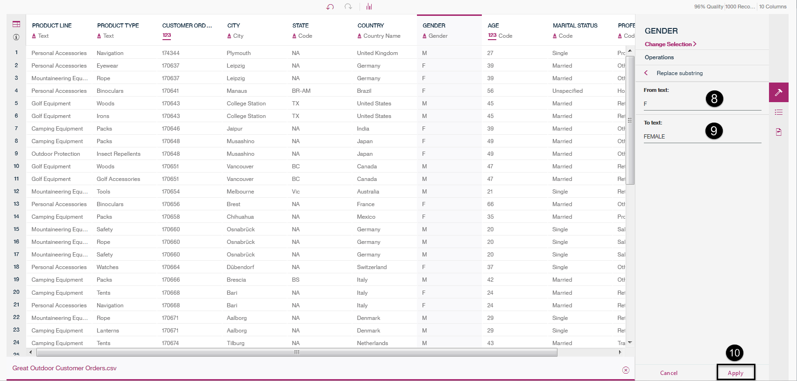

4.	**Enter** "M" (in upper case and without quotes) in the "From Text:" field.
5. **Enter** "MALE" (in upper case and without quotes) in the "To Text:" field.
6. **Select** the "Apply" button at the bottom of the operation panel.

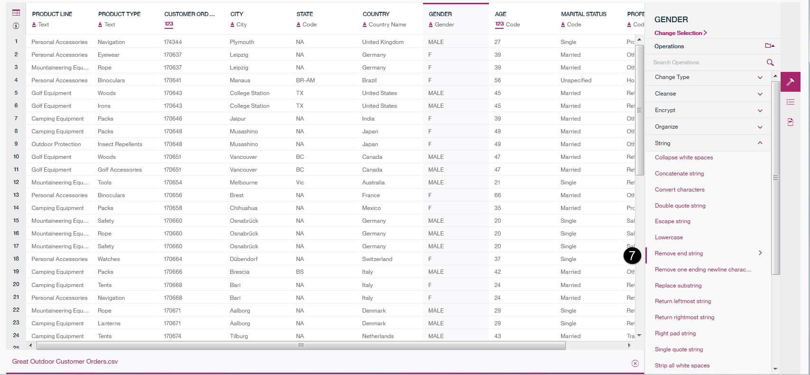

7.	**Select** the "Replace substring" operation from the "String" menu.

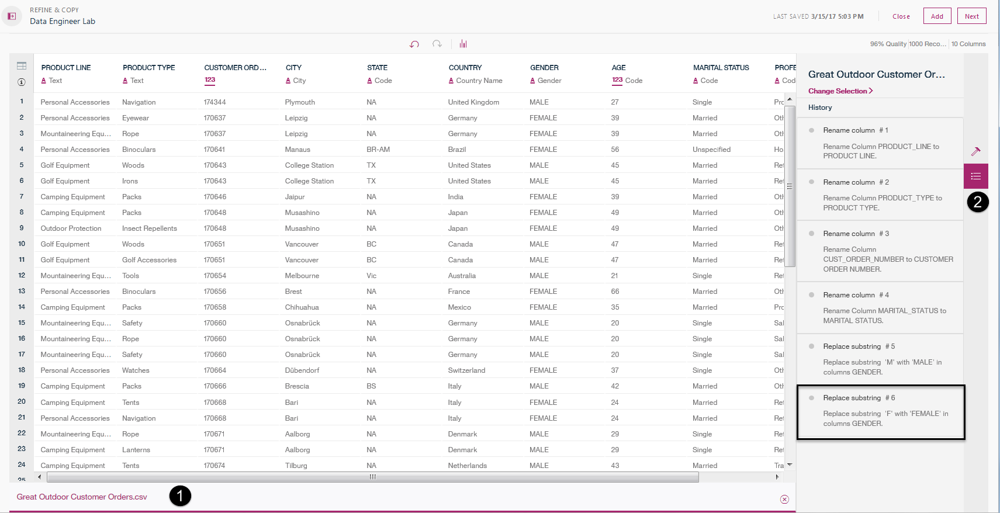

8.	**Enter** "F" (in upper case and without quotes) in the "From Text:" field.
9. **Enter** "FEMALE" (in upper case and without quotes) in the "To Text:" field.
10. **Select** the "Apply" button at the bottom of the operation panel.

> **Notice** that the Gender column values have been changed and that "M" is now "MALE" and "F" is now "FEMALE".

### Review History

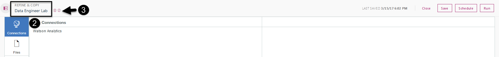

> You can review the history of your shaping actions at any time by invoking the History view. You can also undo and restore actions from the History view.
 
1. **Select** the "Great Outdoor Customer Orders.csv" file to bring it into context.
2.	**Select** the "History" button from the right side panel to view the history of your activity operations.

> You should see that you have performed 6 operations; 4 columns were renamed and 2 Gender column changes with the last operation changing "F" to "Female".

3. **Select** the "Next" button in the top right corner to move onto the next step to complete and run the activity.

## Step 7: Complete and Run the Data Activity

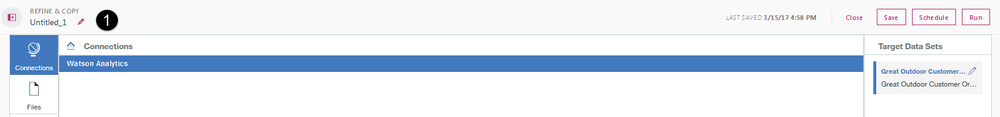

1.	**Select** the "Watson Analytics" connection you created earlier from the list of connections as the target.
2. **Select** the "Run" button in the top right corner to execute the data activities recipe.

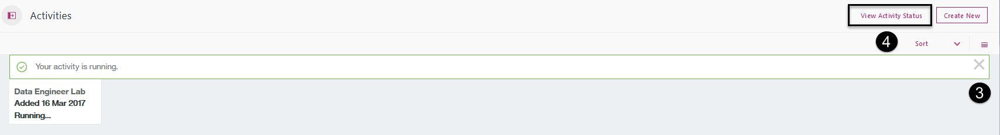

> You will see a message that "Your activity is running"

3.	**Select** the "X" on the message to close the message dialog.
4. **Select** the "View Activity Status" button on the toolbar.

5.	**Select** the "Refresh" button that looks like an arrow pointing to the right on the toolbar of the Activity Status monitor. Continue to do this multiple times to get an update on the activities progress. Continue refreshing the status until you see a 100% Completed status.

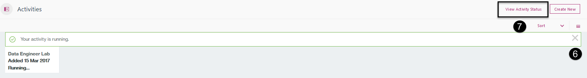

6.	**Select** the "X" on the Activity Status monitor window to close the window.
7. **Select** the menu control button on the far left side to bring back the Data Connect main menu.

## Step 8: Validate the Results

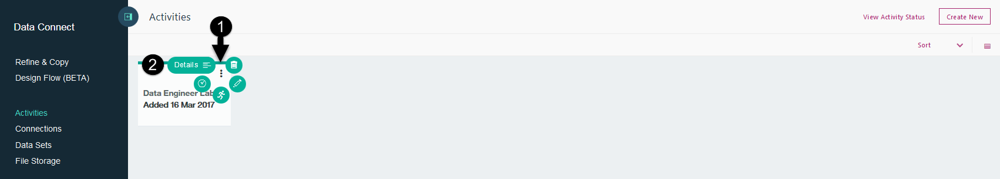

1. **Select** the ellipse in the top right corner of the activity. *Hover over* each icon and you will see which functions you can perform; Details, Delete, Schedule, Run and Edit.
2.	**Select** the "Details" function that looks like a page in a book.

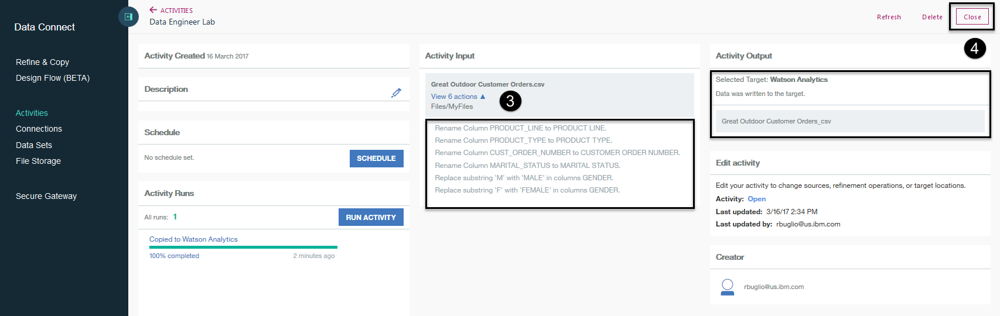

3. **Select** the arrow next to "View 6 Actions" in the "Activity Input" section.

> **Notice** that the 6 operations you performed on the dataset were implemented prior to the data being written to the target. Also notice in the "Activity Output" section that the "Selected Target" was Watson Analytics and that a file named "Great Outdoor Customer Orders.csv" was written to the target. Data Connect writes the output dataset to the Watson Analytics repository and then Watson Analytics registers the dataset in your Watson Analytics account. The dataset will appear on your Watson Analytics home page by the same name.

4.	**Select** the "Close" button at the top of the activity Details section to close the activity Details.

>This concludes the lab. Thank you for taking the time to go through it. I hope you found it useful and you know how a better understanding of the power of the Bluemix Data Connect service and how it can help you easily put your data to work for you.
